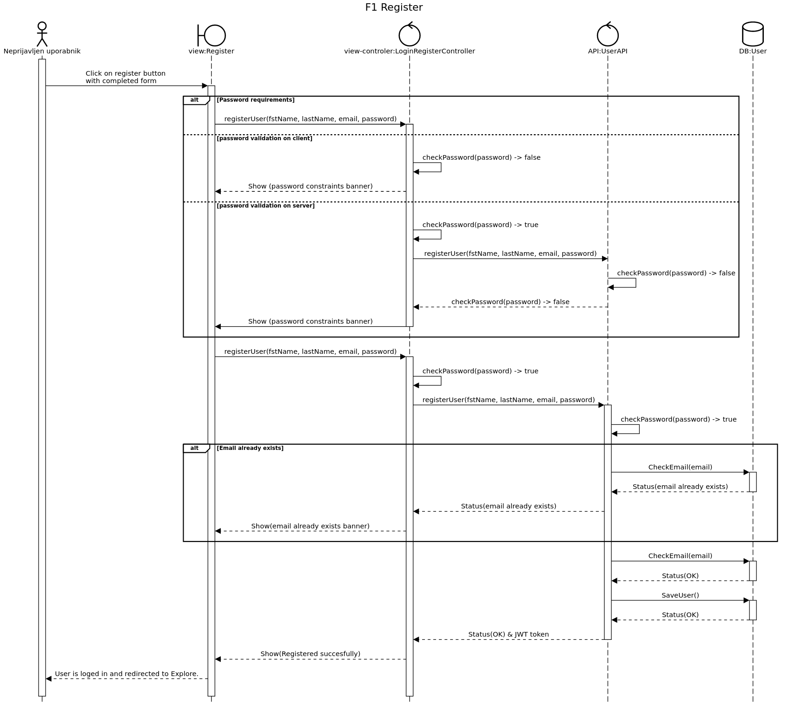

# Načrt sistema

|                             |                                                         |
| :-------------------------- | :------------------------------------------------------ |
| **Naziv projekta**          | Walk Doggers |
| **Člani projektne skupine** | Matic Bregar, Domen Vilar, Timotej Petrič, Mustafa Grabus in Domen Bukovac |
| **Kraj in datum** | Ljubljana, 16.04.2021 |                              |
 

Povzetek
===

Ta dokument predstavlja podroben načrt sistema, katerega smo opisali v drugem delu projketa, v tem dokumentu bolj tehnično predstavimo posamezne komponente in delovanje sistema.

Za načrta arhitekture smo uporabili vzorec **MVC**. Prikaz načrta arhitekture predstavimo z dvemi pogledi:  
**logični pogled:** predstavljen s pomočjo blokovnega diagrama 
**razvojni pogled:** predstavljen z UML komponentnem diagramom.

Načrt strukture sistema je prikazan z razrednim diagramom, kjer so prikazane povezave med razredi. Celotnemu diagramu zaporedja pa sledi tudi posamezen razedni diagram za vsako funkcionalnost, zaradi preglednosti.

Pri načrtih obnašanja smo uporabili diagrame zaporedji, ki prikazejo zaporedje akcji, ki jih izvajlajo posamezne vloge uporabnikov, ter sistemske komponente. Za vsako funkcinalnost iz drugega dela projketa prikažemo osnove, alternativne ter izjemne tokove.

Uporabili smo dva načrtovalska vzorca, in sicer:
**Singleton** in
**State**

## 1. Načrt arhitekture

### Logicni pogled

Logicni pogled je predstavljen z blokovnim diagramom, iz njega je lepo vidna MVC arhitektura ter posamezne komponente, ki so razdeljene na Poglede, Krmilnike in Modele. Na njem se vidi tudi delitev baze na PostgresSQL, ki je uporabljena za podatke, kjer lahko podatke enostavno prikažemo z relacijskimi povezavami, ter MongoDB, ki je uporabljana za pogosto spreminjajoče sporočila med dvema uporabnikoma.

## 2. Načrt strukture

### 2.1 Razredni diagram

**TO-DO**

- Izdelajte razredni diagram.

### 2.2 Opis razredov

### ExploreView

Razred ExploreView predstavlja mejni razred primera uporabe pregledovanja in iskanja oglasov. Gre za **pogled** v arhitekturnem vzorcu MVC.

#### Atributi

Ta razred nima atributov.

#### Nesamoumevne metode

| Ime metode           | Imena in tipi parametrov | Tip rezultata | Pomen (če ni očiten)           |
|:---------------------|:-------------------------|:--------------|:-------------------------------|
| toggleFilter()       | -                        | void          | Odpri oz. zapri filter iskanja |
| search()             | -                        | void          | -                              |
| openListingDetails() | -                        | void          | -                              |
| adminDeleteListing() | -                        | void          | -                              |

__________________________________________________________________________

### Explore

Razred Explore predstavlja kontrolni razred primera uporabe pri razdelku ExploreView. Uporablja se za iskanje in filtriranje oglasov in pošiljanje le teh v ExploreView. Gre za **krmilnik** v arhitekturnem vzorcu MVC.

#### Atributi

| Ime atributa | Podatkovni tip(če ni očiten) | Zaloga vrednosti(če ni očitna) | Pomen (če ni očiten) |
| --- | --- | --- | --- |
| listings | List\<> | Listing | Lista posameznih oglasov, ki bodo prikazani na strani |

#### Nesamoumevne metode

| Ime metode | Imena in tipi parametrov | Tip rezultata | Pomen (če ni očiten) |
|---|---|---|---| 
| getLocation() |                         - | List\<float> | Pridobi uporabnikovo lokacijo |
| showErrorNoListings()  |                - | void | - |
| search() | weight: List\<int>,  distanceMax: int,  lat: float,  float: float | List\<Listing> | - |
| openListingDetails() |     listingId: str | void | - |
| showErrorLocationPermissionRequired() | - | void | - |
| adminDeleteListing() |     listingId: str | bool | Administratorju omogoči izbris oglasa |

__________________________________________________________________________
 

### ListingsAPI

Ta razred skrbi za dostopanje do entitetnega modela Listing. Omogoča spreminjanje in pridobivanje vnosov oglasov. Gre za **krmilnik** v arhitekturnem vzorcu MVC.

#### Atributi

Ta razred nima atributov.

#### Nesamoumevne metode

| Ime metode                      | Imena in tipi parametrov                                                   | Tip rezultata  | Pomen (če ni očiten)                               |
|:--------------------------------|:---------------------------------------------------------------------------|:---------------|:---------------------------------------------------|
| search()                        | weight: List\<int>,  distanceMax: int,  lat: float,  float: float | List\<Listing> | -                                                  |
| getListingDetails()             | listingId: str                                                             | Listing        | -                                                  |
| addRequest()                    | listingId: str,  userId: str                                            | bool           | -                                           |
| addSoftApply()                  | listingId: str,  userId: str                                            | bool           | Doda mehko prijavo sprehajalca na nek oglas |
| confirmWalker()                 | listingId: str,  userId: str                                            | bool           | Potrdi enega od uporabnikov kot sprehajalca   |
| getMyListings()                 | userId: str                                                                | List\<Listing> | Pridobi uporabnikove objavljene oglase             |
| getAppliedListings()            | userId: str                                                                | List\<Listing> | Pridobi uporabnikove za sprehod prijavljene oglase |
| getActiveListingsConversation() | userId1: str,  userId2: str                                             |   List\<Listing>     | Pridobijo se oglasi, ki jih vrneta funkciji getMyListingsByApplied() in getAppliedListingsByOwner() |
| getMyListingsByApplied()        | ownerId: str,  walkerId: str                                            | List\<Listing>       | Pridobijo se objavljeni oglasi lastnika z ownerId, na katere je prijavljen sprehajalec walkerId. |
| getAppliedListingsByOwner()     | walkerId: str,  ownerId: str                                            | List\<Listing>       | Pridobijo se oglasi na katere je prijavljen sprehajalec walkerId in lastnik oglasov je ownerId.                                            |
| adminDeleteListing()            | listingId: str                                                             | status       | Izbris oglasa                                      |
| getLocationText()               | lat: float,  lon: float                                                 | str            | Iz koordinat pridobi tekst naslova oglasa          |

__________________________________________________________________________
 

### Listing

Ta razred skrbi za shranjevanje, urejanja in pridobivanje podatkov o oglasih. Gre za **model** v arhitekturnem vzorcu MVC.

#### Atributi

| Ime atributa | Podatkovni tip(če ni očiten) | Zaloga vrednosti(če ni očitna) | Pomen (če ni očiten) |
| --- | --- | --- | --- |
| title           | str      | - | - |
| description     | str      | - | - |
| dateStart       | dateTime | - | - |
| dateEnd         | dateTime | - | - |
| locationCoordinatesLon | float | - | - |
| locationCoordinatesLat | float | - | - |
| locationText       | str   | - | - |
| dogId              | str   | - | - |
| ownerId            | str   | - | - |
| interestedWalkersIds  | List\<str> | - | Seznam idjev sprehajalcev prijavljenih na oglas |
| softAppliedWalkersIds | List\<str> | - | Seznam idjev sprehajalcev, ki so kontaktirali lastnika, vendar se še niso prijavili na oglas. |
| confirmedWalker    | str   | - | Id potrjenega sprehajalca |

#### Nesamoumevne metode

| Ime metode | Imena in tipi parametrov | Tip rezultata | Pomen (če ni očiten) |
| --- | --- | --- | --- |
| addInterestedWalker() | listingId: str,  userId: str | List\<str> | Ko se sprehajalec prijavi na oglas, se to zapiše. |
| addSoftApplyWalker()  | listingId: str,  userId: str | List\<str> | Sprehajalec pošlje sporočilo še preden pošlje prošnjo za prijavo na oglas. |

__________________________________________________________________________
 

### ConfirmedListingState, ConfirmedListing in UnconfirmedListing

Uporabili smo načrtovalski vzorec State, saj imamo objekt razreda Listing, ki uporablja različne metode glede na stanje v katerem je objekt. Listing ima različne metode glede na status oglasa, ki je lahko confirmed oz. unconfirmed. Če je sprehajalec potrjen, lahko ocenimo sprehajalca, če sprehajalec še ni potrjen, sprehajalca ne moremo oceniti. Po klicu metode confirmWalker(), oglas nima več metod addInterestedWalker(), addSoftApplyWalker() in confirmWalker(), pridobi pa metodo leaveReview().	

### ListingDetailsView

V tem pogledu lahko pregledujemo podrobnosti objav. Gre za pogled v arhitekturnem vzorcu MVC.

#### Atributi

Ta razred nima atributov.

#### Nesamoumevne metode

| Ime metode | Imena in tipi parametrov | Tip rezultata | Pomen (če ni očiten) |
| --- | --- | --- | --- |
| imInterested() | - | void | Uporabnik se prijavi na oglas |
| deleteListing() | - | void | Administrator lahko pobriše oglas. |

__________________________________________________________________________
 

### ListingDetails

Ta razred se uporablja za pridobivanje podrobnosti oglasov in odpiranje pogovorov z lastniki. Gre za **krmilnik** v arhitekturnem vzorcu MVC.

#### Atributi

| Ime atributa | Podatkovni tip(če ni očiten) | Zaloga vrednosti(če ni očitna) | Pomen (če ni očiten) |
| --- | --- | --- | --- |
| title             | str | -   | - |
| description       | str | -   | - |
| dateStart         | dateTime  | - | - |
| dateEnd           | dateTime  | - | - |
| locationText      | str | -   | - |
| ownerName         | str | -   | - |
| ownerDescription  | str | -   | - |
| ownerReview       | float | -  | - |
| dogName           | str | -   | - |
| dogDescription    | str | -   | - |
| dogWeight         | int | -   | - |

#### Nesamoumevne metode

| Ime metode | Imena in tipi parametrov | Tip rezultata | Pomen (če ni očiten) |
| --- | --- | --- | --- |
| openConversation() | conversationId: str,  listingId: str | void | Odpre pogovor z lastnikom |
| getListingDetails() | listingId: str | Listing | - |
| getOwnerInfo()     | ownerId: str | Dog | - |
| getDogInfo()       | dogId: str | User | - |

__________________________________________________________________________
 

### ListingsView

Ta pogled omogoča uporabniko pregled prijavljenih in objavljenih oglasov. Gre za **pogled** v arhitekturnem vzorcu MVC.

#### Atributi

Ta razred nima atributov.

#### Nesamoumevne metode

| Ime metode | Imena in tipi parametrov | Tip rezultata | Pomen (če ni očiten) |
| --- | --- | --- | --- |
| openAddListing()      | - | void | Odpre pogled za dodajanje oglasov |
| openMyListings()      | - | void | Odpre zavihek My Listings |
| openAppliedListings() | - | void | Odpre zavihek Applied |
| showAppliedUsers()    | - | void | Odpre Inbox pogled s prijavljenimi ljudmi |
| leaveFeedback()       | - | void | Omogoči dodajanje ocene uporabnika |
| messageOwner()        | - | void | Odpre pogovor z lastnikom |

__________________________________________________________________________
 

### ListingsViewController

Ta kontrolni razred nalaga prijavljene in objavljane oglase ter na splošno podpira delovanje pogleda ListingsView. Gre za **krmilnik** v arhitekturnem vzorcu MVC.

#### Atributi

| Ime atributa | Podatkovni tip(če ni očiten) | Zaloga vrednosti(če ni očitna) | Pomen (če ni očiten) |
| --- | --- | --- | --- |
| myListings | List\<Listing> | - | - |
| appliedListings | List\<Listing> | - | - |

#### Nesamoumevne metode

| Ime metode           | Imena in tipi parametrov                                                                                                                          | Tip rezultata  | Pomen (če ni očiten)                      |
| -------------------- | ------------------------------------------------------------------------------------------------------------------------------------------------- | -------------- | ----------------------------------------- |
| openAddListing()     | -                                                                                                                                                 | void           | Odpre pogled za dodajanje oglasov         |
| getAppliedListings() | userId: str                                                                                                                                       | List\<Listing> | -                                         |
| showAppliedUsers()   | -                                                                                                                                                 | void           | Odpre Inbox pogled s prijavljenimi ljudmi |
| leaveFeedback()      | rating: int,  userId: str                                                                                                                      | void           | Omogoči dodajanje ocene uporabnika        |
| getMyListings()      | userId: str                                                                                                                                       | List\<Listing> | -                                         |
| messageOwner()       | -                                                                                                                                                 | void           | Odpre pogovor z lastnikom                 |
| publishListing()     | title:string,  dogId: str,  desc: str,  datetimeFrom: datetime,  datetimeTo: datetime,  locationLon: float,  locationLat: float | bool           | Dodajanje oglasa                          |
| getLocation()        | -                                                                                                                                                 | List\<float>   | Pridobi uporabnikovo lokacijo             |
| getUserDogs()        | -                                                                                                                                                 | List\<Dog>     | Pridobi uporabnikove pse                  |

__________________________________________________________________________
 

### NewListingView

Ta razred omogoča uporabniku dodajanje novih oglasov. Gre za **pogled** v arhitekturnem vzorcu MVC.

#### Atributi

Ta razred nima atributov.

#### Nesamoumevne metode

| Ime metode | Imena in tipi parametrov | Tip rezultata | Pomen (če ni očiten) |
| --- | --- | --- | --- |
| publishListing() | title: str,  dogId: str,  desc: str,  datetimeFrom: datetime,  datetimeTo: datetime | void | - |

__________________________________________________________________________
 

### LeaveFeedbackView

Ta razred omogoča uporabniku oddajo ocene uporanika. Gre za **pogled** v arhitekturnem vzorcu MVC.

#### Atributi

Ta razred nima atributov.

#### Nesamoumevne metode

| Ime metode | Imena in tipi parametrov | Tip rezultata | Pomen (če ni očiten) |
| --- | --- | --- | --- |
| submitFeedback() | - | void | Dodaj oceno uporabniku |

__________________________________________________________________________
 

### NavigationMenuView

Ta razred uporabniku omogoča premikanje med glavnimi razdelki v aplikaciji. Nahaja se na dnu vsakega pogleda. Gre za **pogled** v arhitekturnem vzorcu MVC. Opomba: vsi ostali pogledi imajo dostop do tega pogleda, vendar zaradi preglednosti to ni prikazano na razrednem diagramu.

#### Atributi

Ta razred nima atributov.

#### Nesamoumevne metode

| Ime metode | Imena in tipi parametrov | Tip rezultata | Pomen (če ni očiten) |
| --- | --- | --- | --- |
| explore() | - | void | Odpre ExploreView |
| inbox() | - | void | Odpre InboxView |
| blog() | - | void | Odpre BlogView |
| listings() | - | void | Odpre ListingsView |
| settings() | - | void | Odpre SettingsView |

__________________________________________________________________________
 

### NavigationMenu

Ta razred je podporni razred za pogled NavigationMenuView. Omogoča povezavo z ostalimi podpornimi razredi, ki odpirajo poglede glavnih razdelkov aplikacije. Gre za **krmilnik** v arhitekturnem vzorcu MVC.

#### Atributi

Ta razred nima atributov.

#### Nesamoumevne metode

| Ime metode | Imena in tipi parametrov | Tip rezultata | Pomen (če ni očiten) |
| --- | --- | --- | --- |
| openExplore() | - | void | Odpre ExploreView |
| openInbox() | - | void | Odpre InboxView |
| openBlog() | - | void | Odpre BlogView |
| openListings() | - | void | Odpre ListingsView |
| openSettings() | - | void | Odpre SettingsView |

__________________________________________________________________________
 

### LoginRegisterController

Ta razred je podporni razred za pogleda RegisterView in LoginView. Gre za **krmilnik** v arhitekturnem vzorcu MVC.

#### Atributi

Ta razred nima atributov.

#### Nesamoumevne metode

| Ime metode | Imena in tipi parametrov | Tip rezultata | Pomen (če ni očiten) |
| --- | --- | --- | --- |
| checkEmail()      | mail: str | bool | Preveri če je email veljavne oblike |
| checkPassword()   | password: str | bool | Preveri če je geslo veljavne oblike |
| registerUser()    | firstName: str,  lastName: str,  email: str,  password: str | bool | - |
| signInUser()      | email: str, password: str | bool | - |

__________________________________________________________________________
 

### UserAPI

Ta razred skrbi za dostopanje do entitetnega modela User. Gre za **krmilnik** v arhitekturnem vzorcu MVC.

#### Atributi

Ta razred nima atributov.

#### Nesamoumevne metode

| Ime metode | Imena in tipi parametrov | Tip rezultata | Pomen (če ni očiten) |
| --- | --- | --- | --- |
| registerUser()   | firstName: str,  lastName: str,  email: str,  password: str | token | - |
| signInUser()     | email: str,  password: str | token | - |
| checkEmail()     | mail: str          | bool | Preveri če je email že zaseden |
| checkPassword()  | password: str      | bool | Preveri če je geslo veljavne oblike |
| validateJwt()    | jwt: str           | str | - |
| addReviewScore() | userId: str,  review: float  | status | - |
| editProfile()    | userId: str,  fstName: str,  lstName: str,  email: str,  about: str  | status | - |
| becomeReporter() | userId: str        | status | - |

__________________________________________________________________________
 

### BecomeReporterView

Ta razred omogoča uporabniku, da postane pisec bloga, če to še ni. Gre za **pogled** v arhitekturnem vzorcu MVC.

#### Atributi

Ta razred nima atributov.

#### Nesamoumevne metode

| Ime metode | Imena in tipi parametrov | Tip rezultata | Pomen (če ni očiten) |
| --- | --- | --- | --- |
| becomeReporter() | - | void | - |

__________________________________________________________________________
 

### BecomeReporter

Ta razred je podporni razred za pogled BecomeReporterView. Omogoča da uporabnik postane pisec bloga. Gre za **krmilnik** v arhitekturnem vzorcu MVC.

#### Atributi

Ta razred nima atributov.

#### Nesamoumevne metode

| Ime metode | Imena in tipi parametrov | Tip rezultata | Pomen (če ni očiten) |
| --- | --- | --- | --- |
| becomeReporter() | userId: str | status | - |

__________________________________________________________________________
 

### User

Ta razred skrbi za shranjevanje, urejanja in pridobivanje podatkov uporabnikov. Gre za **model** v arhitekturnem vzorcu MVC.

#### Atributi

| Ime atributa | Podatkovni tip(če ni očiten) | Zaloga vrednosti(če ni očitna) | Pomen (če ni očiten) |
| --- | --- | --- | --- |
| userId | str | - | - |
| name | str | - | - |
| lastname | str | - | - |
| email | str | - | - |
| hashedPass | str | - | - |
| description | str | - | - |
| reviewScores | List\<int> | - | Seznam vseh ocen uporabnika |
| reviewScore | float | - | Povprečna ocena uporabnika |
| isReporter | bool | - | Status pisca |
| image | bytes | - | - |

#### Nesamoumevne metode

| Ime metode | Imena in tipi parametrov | Tip rezultata | Pomen (če ni očiten) |
| --- | --- | --- | --- |
| verifyCredentials() | email: str,  password: str | str{userId} | - |
| addReviewScore()    | score: int,  userId: str | void | - |

__________________________________________________________________________
 

### RegisterView

Ta razred omogoča uporabniku, da se registrira. Gre za **pogled** v arhitekturnem vzorcu MVC.

#### Atributi

Ta razred nima atributov.

#### Nesamoumevne metode

| Ime metode | Imena in tipi parametrov | Tip rezultata | Pomen (če ni očiten) |
| --- | --- | --- | --- |
| register() | - | void | - |
| openLogin() | - | void | - |

__________________________________________________________________________
 

### LoginView

Ta razred omogoča uporabniku, da se prijavi v aplikacijo. Gre za **pogled** v arhitekturnem vzorcu MVC.

#### Atributi

Ta razred nima atributov.

#### Nesamoumevne metode

| Ime metode | Imena in tipi parametrov | Tip rezultata | Pomen (če ni očiten) |
| --- | --- | --- | --- |
| login() | - | void | - |
| openRegistration() | - | void | - |

__________________________________________________________________________
 

### BlogPost

Ta razred se uporablja pri vseh aktivnostih, kjer je potrebno dostopati do blogov in jih spreminjati (npr. dodajati, brisati in potrjevati bloge). Gre za **model** v arhitekturnem vzorcu MVC.

#### Atributi

| Ime atributa | Podatkovni tip(če ni očiten) | Zaloga vrednosti(če ni očitna) | Pomen (če ni očiten) |
| --- | --- | --- | --- |
| title | str |  | - |
| content | str |  | - |
| image | bytes |  | - |
| datePosted | dateTime |  | - |
| modConfirmed | bool |  | Če je oglas moderator že potrdil. |
| authorId | str |  | - |
| moderatorId | str |  | - |
| postId | str |  | - |

#### Nesamoumevne metode

| Ime metode        | Imena in tipi parametrov                       | Tip rezultata  | Pomen (če ni očiten)                  |
|:------------------|:-----------------------------------------------|:---------------|:--------------------------------------|
| addNewBlogPost()  | title: str,  image: bytes,  content: str | success: bool  | -                                     |
| getPostDetails()  | postId: str                                    | post: BlogPost | Vrnemo podrobnosti posta.             |
| adminDeletePost() | postId: str                                    | success: bool  | Administratorju omogoči izbris objave |

__________________________________________________________________________

### BlogAPI
Ta razred se uporablja pri vseh aktivnostih, kjer je potrebno dostopati do entitetnega modela Blog in ga spreminjati. Gre za **krmilnik** v arhitekturnem vzorcu MVC.

#### Atributi

Razred nima atributov.

#### Nesamoumevne metode

| Ime metode           | Imena in tipi parametrov                       | Tip rezultata    | Pomen (če ni očiten)      |
|:---------------------|:-----------------------------------------------|:-----------------|:--------------------------|
| addNewBlogPost()     | title: str,  image: bytes,  content: str | success: boolean |                           |
| getPostDetails()     | postId: str                                    | post: Blog       | Vrnemo podrobnosti posta. |
| adminDeletePost()    | postId                                         | success: boolean |                           |
| modConfirmBlogPost() | postId: str,  confirm: bool                 | success: boolean | Moderator potrdi ali zavrne javno vidnost objave |

__________________________________________________________________________

### BlogController

Ta razred se uporablja pri vseh aktivnostih, ki so povezane z branjem, dodajanjem, potrjevanjem in brisanjem bloga. Gre za **krmilnik** v arhitekturnem vzorcu MVC.

#### Atributi

Ta razred nima atributov.

#### Nesamoumevne metode

| Ime metode           | Imena in tipi parametrov                       | Tip rezultata   | Pomen (če ni očiten)                             |
|:---------------------|:-----------------------------------------------|:----------------|:-------------------------------------------------|
| openPostDetails()    | postId: str                                    | void            | Odpre podrobnosti objave.                        |
| openNewBlogPost()    | -                                              | void            | Odpre pogled, kjer lahko dodamo nov blog objavo. |
| addNewBlogPost()     | title: str   image: bytes   content: str | bool            | Ustvarimo novo objavo                            |
| modConfirmBlogPost() | postId: str   confirm: bool                 | void            | Moderator potrdi blog objavo.                    |
| adminDeletePost()    | postId: str                                    | void            | Admin izbriše objavo.                            |
| checkInputForms()    | -                                              | void            | Preverimo pravilnost vhodnih podatkov.           |
| loadPosts()          | -                                              | List\<BlogPost> | Pridobimo vse objave in jih prikažemo.           |

__________________________________________________________________________

### BlogView

V tem pogledu lahko brskamo po objavah in jih dodajamo. Gre za **pogled** v arhitekturnem vzorcu MVC.

#### Atributi

Ta razred nima atributov.

#### Nesamoumevne metode

| Ime metode | Imena in tipi parametrov | Tip rezultata | Pomen (če ni očiten) |
| --- | --- | --- | --- |
| newPost() | - | void | Prikažemo pogled, kjer lahko dodamo novo objavo. |
| readMore() | - | void | Prikažemo podrobnosti objave. |
__________________________________________________________________________
 

### NewBlogPostView

V tem pogledu vnesemo vse potrebne podatke za dodajanje objave. Gre za **pogled** v arhitekturnem vzorcu MVC.

#### Atributi

Ta razred nima atributov.

#### Nesamoumevne metode

| Ime metode | Imena in tipi parametrov | Tip rezultata | Pomen (če ni očiten) |
| --- | --- | --- | --- |
| createBlogPost() | - | void | Dodamo novo objavo. |
__________________________________________________________________________
 

### BlogPostDetailsView

V tem pogledu lahko objavo preberemo, potrdimo oz. izbrišemo. Gre za **pogled** v arhitekturnem vzorcu MVC.

#### Atributi

Ta razred nima atributov.

#### Nesamoumevne metode

| Ime metode | Imena in tipi parametrov | Tip rezultata | Pomen (če ni očiten) |
| --- | --- | --- | --- |
| modRedaction()    | - | void | Moderator objavo potrdi oz. zavrne. |
| adminDeletePost() | - | void | Administrator lahko izbriše objavo. |

__________________________________________________________________________
 

### Settings

Krmilnik skrbi za odpiranje nastavitev profila in dodanih psov, povišanje v reporterja in odjavo. Gre za **krmilnik** v arhitekturnem vzorcu MVC.

#### Atributi

Ta razred nima atributov.

#### Nesamoumevne metode

| Ime metode | Imena in tipi parametrov | Tip rezultata | Pomen (če ni očiten) |
| --- | --- | --- | --- |
| openProfileSettings() | - | void | - |
| openDogsSettings() | - | void | - |
| openBecomeAReporter() | - | void | - |
| logout() | - | void | - |

__________________________________________________________________________
 

### SettingsView

Pogled skrbi za odpiranje različnih nastavitev uporabnika in odjavo. Gre za **pogled** v arhitekturnem vzorcu MVC.

#### Atributi

Ta razred nima atributov.

#### Nesamoumevne metode

| Ime metode | Imena in tipi parametrov | Tip rezultata | Pomen (če ni očiten) |
| --- | --- | --- | --- |
| openProfileSettings() | userId: str | void | - |
| openDogsSettings() | userId: str | void | - |
| openBecomeAReporter() | userId: str | void | - |
| logout() | - | void | - |

__________________________________________________________________________
 

### Profile

Ta razred se uporablja za urejanje profila uporabnika. Gre za **krmilnik** v arhitekturnem vzorcu MVC.

#### Atributi

| Ime atributa | Podatkovni tip(če ni očiten) | Zaloga vrednosti(če ni očitna) | Pomen (če ni očiten) |
| --- | --- | --- | --- |
| fstName | str | - | - |
| lstName | str | - | - |
| email | str | - | - |
| about | str | - | - |

#### Nesamoumevne metode

| Ime metode | Imena in tipi parametrov | Tip rezultata | Pomen (če ni očiten) |
| --- | --- | --- | --- |
| editProfile() |userId: str  fstName: str  lstName: str  email: str  about: str | void | - |
| checkAboutLen() | - | void | Preveri dolžino vnosnega polja about. |

__________________________________________________________________________
 

### ProfileSettingView

Pogled skrbi za prikaz urejanje nastavitev profila. Gre za **pogled** v arhitekturnem vzorcu MVC.

#### Atributi

Ta razred nima atributov.

#### Nesamoumevne metode

| Ime metode | Imena in tipi parametrov | Tip rezultata | Pomen (če ni očiten) |
| --- | --- | --- | --- |
| saveChanges() | - | void | Posodobimo profil uporabnika. |

__________________________________________________________________________
 

### DogsController

Razred skrbi za urejanje in dodajanje psov. Gre za **krmilnik** v arhitekturnem vzorcu MVC.

#### Atributi

| Ime atributa | Podatkovni tip(če ni očiten) | Zaloga vrednosti(če ni očitna) | Pomen (če ni očiten) |
| --- | --- | --- | --- |
| dogs | List\<Dogs> | - | Vsi vnešeni uporabnikovi psi. |
| name | str | - | -|
| descr | str | - | - |
| size | int | - | - |
| photo | bytes | - | - |

#### Nesamoumevne metode

| Ime metode | Imena in tipi parametrov | Tip rezultata | Pomen (če ni očiten) |
| --- | --- | --- | --- |
| editDog() | dogId: str   name: str  description:str   size: int   photo: bytes | void | - |
| addDog() | userId: str   name: str  description:str   size: int   photo: bytes | void | - |
| checkInputForms() | - | bool | Preverimo, če so vnosna polja izpolnjena.|

__________________________________________________________________________
 

### MyDogsView

Pogled skrbi za prikaz vnešenih psov. Gre za **pogled** v arhitekturnem vzorcu MVC.

#### Atributi

Ta razred nima atributov.

#### Nesamoumevne metode

| Ime metode | Imena in tipi parametrov | Tip rezultata | Pomen (če ni očiten) |
| --- | --- | --- | --- |
| editDog() | - | void | - |
| addDog() | - | void | - |

__________________________________________________________________________
 

### DogEditOrNewView

Pogled skrbi za dodajanje in urejanje psov. Gre za **pogled** v arhitekturnem vzorcu MVC.

#### Atributi
Ta razred nima atributov.

#### Nesamoumevne metode

| Ime metode | Imena in tipi parametrov | Tip rezultata | Pomen (če ni očiten) |
| --- | --- | --- | --- |
| editDog() | - | void | - |
| addDog() | - | void | - |

__________________________________________________________________________
 

### DogsAPI

Razred skrbi za pridobivanje, dodajanje in urejanje entitetnega modela Dog. Gre za **krmilnik** v arhitekturnem vzorcu MVC.

#### Atributi

Ta razred nima atributov.

#### Nesamoumevne metode

| Ime metode | Imena in tipi parametrov | Tip rezultata | Pomen (če ni očiten) |
| --- | --- | --- | --- |
| editDog() | dogId: str   name: str   description: str   size: int   photo: bytes | bool | - |
| addDog() | userId: str   dogId: str   name: str   description: str   size: int   photo: bytes | bool | - |
| checkInput() | - | bool | Preverimo pravilnost vhodnih podatkov. |

__________________________________________________________________________
 

### Dog

Ta razred skrbi za shranjevanje, urejanja in pridobivanje psov. Gre za **model** v arhitekturnem vzorcu MVC.

#### Atributi

| Ime atributa | Podatkovni tip(če ni očiten) | Zaloga vrednosti(če ni očitna) | Pomen (če ni očiten) |
| --- | --- | --- | --- |
|ownerId|str|-|-
| dogId | str | - | - |
| name | str | - | - |
| description | str | - | - |
| size | int | - | - |
| photo | bytes | - | - |
| description | str | - | - |

#### Nesamoumevne metode

Ta razred nima metod. 
__________________________________________________________________________
 

### ConversationView

Pogled skrbi za prikaz in pošiljanje sporočil ter potrjevanje in pošiljanje prošenj. Gre za **pogled** v arhitekturnem vzorcu MVC.

#### Atributi

Ta razred nima atributov.

#### Nesamoumevne metode

| Ime metode | Imena in tipi parametrov | Tip rezultata | Pomen (če ni očiten) |
| --- | --- | --- | --- |
| sendRequest() | - | void | - |
| confirmWalker() | - | void | - |

__________________________________________________________________________
 

### ConversationController

Ta razred skrbi za vse aktivnosti, ki jih uporabnik lahko počne v pogovoru, kot so pošiljanje sporočil, prošenj za sprehajanje ter potrjevanje prošenj. Gre za **krmilnik** v arhitekturnem vzorcu MVC.

#### Atributi

Ta razred nima atributov.

#### Nesamoumevne metode

| Ime metode | Imena in tipi parametrov | Tip rezultata | Pomen (če ni očiten) |
| --- | --- | --- | --- |
| getConversationMesages() | conversationId: str | List\<Message> | - |
| loadActiveListingsConversation() | userId1: str   userId2: str | activeListings: List\<Listing> | V pogovoru z osebo userId2 pridobimo vse aktivne oglase, kjer smo kot userId1 prijavljeni na oglas osebe userId2 oz. je userId2 prijavljen kot sprehajalec na oglas osebe userId1. |
| selectActiveListingInConversation() | listingId: str | void | V oknu, kjer se prikazani vsi aktivni oglasi, izberemo oglas z listingId. |
| sendRequest() | userId: str listingId: str | void | Sprehajalec pošlje prošnjo za prijavo na oglas. |
| confirmWalker() | walkerId: str, listingId: str | void | Potrdimo sprehajalca za naš oglas. |
| sendMessage() | conversationId: str  senderId: str  text: str | void | - |

__________________________________________________________________________
 

### ConversationAPI

Ta razred se uporablja pri vseh aktivnostih, kjer je potrebno dostopati do entitetnega modela Conversation in ga spreminjati. Gre za krmilnik v arhitekturnem vzorcu MVC.

#### Atributi

Ta razred nima atributov.

#### Nesamoumevne metode

| Ime metode | Imena in tipi parametrov | Tip rezultata | Pomen (če ni očiten) |
| --- | --- | --- | --- |
| getConversationsByListing() | userId: str, listingId: str | List\<Conversation> | Če je userId == ownerId, pridobi vse pogovore s prijavljenimi sprehajalci, drugače pridobi pogovor z lastnikom oglasa. |
| getConversationMessages() | conversationId: str | List\<Message> | -
| addMessage() | conversationId: str  senderId: str  text: str | status | - |
| getConversation() | userId1: str  userId2: str | conversationId: str | Pridobimo pogovor med dvema uporabnikoma.
| createConversation() | userId1: str   userId2: str | status | Ustvarimo pogovor med dvema uporabnikoma.
__________________________________________________________________________
 

### Conversation
Ta razred skrbi za shranjevanje, dodajanje in pridobivanje pogovorov. Gre za **model** v arhitekturnem vzorcu MVC.

#### Atributi

| Ime atributa | Podatkovni tip(če ni očiten) | Zaloga vrednosti(če ni očitna) | Pomen (če ni očiten) |
| --- | --- | --- | --- |
| convId | str | - | - |
| user1Id | str | - | - |
| user2Id | str | - | - |
| messages | List\<Message> | - | Vsa sporočila v pogovoru. |

#### Nesamoumevne metode

| Ime metode | Imena in tipi parametrov | Tip rezultata | Pomen (če ni očiten) |
| --- | --- | --- | --- |
| getConversations() | userId: str | List\<Conversation> | Pridobimo vse pogovore uporabnika. |
| getMessages() | convId: str | List\<Message> | bool |
| addMessage() | senderId: str  convId: str  message: Message | bool | - |
| sendMessage() | senderId: str  convId: str  message: Message | bool | - |

__________________________________________________________________________
 

### Message
Ta razred je entitetni model, ki predstavlja sporočilo. Gre za **model** v arhitekturnem vzorcu MVC.

#### Atributi

| Ime atributa | Podatkovni tip(če ni očiten) | Zaloga vrednosti(če ni očitna) | Pomen (če ni očiten) |
| --- | --- | --- | --- |
| msgId | str | - | - |
| senderId | str | - | - |
| text | str | - | - |
| date | dateTime | - | - |

__________________________________________________________________________
 

### InboxController

Ta razred se uporablja, da se pridobijo vsi aktivni oglasi med kateremi se uporabnik lahko premika in pogovori z osebami. Gre za **krmilnik** v arhitekturnem vzorcu MVC.

#### Atributi

| Ime atributa | Podatkovni tip(če ni očiten) | Zaloga vrednosti(če ni očitna) | Pomen (če ni očiten) |
| --- | --- | --- | --- |
| conversations | List\<Conversation> | - | Vsi pogovori z osebami. |
| activeListings | List\<Listing> | - | Aktivni oglasi, ki so v prihodnosti.|

#### Nesamoumevne metode

| Ime metode | Imena in tipi parametrov | Tip rezultata | Pomen (če ni očiten) |
| --- | --- | --- | --- |
| loadFilterWindow() | userId: str | void | V filtrirno okno oglasov naložimo vse aktivne oglase uporabnika. |
| selectListingInFilterWindow() | listingId: str | void | V filtrirnem oknu oglasov izberemo želeni oglas. |
| getConversationsByListing() | userId: str, listingId: str | List\<Conversation> | Pridobi vse pogovore s prijavljenimi sprehajalci oz. pogovor z lastnikom oglasa. |
| openConversation() | conversationId: str | void | Odpre pogled pogovora. |
| getUserConversations() | userId: str | List\<Conversation> | - |
| getActiveListings() | userId: str |  List\<Listing> | Pridobi aktivne oglase uporabnika (prijavljene in objavljene). |

__________________________________________________________________________
 

### InboxView

Pogled skrbi za prikaz in pošiljanje sporočil ter potrjevanje in pošiljanje prošenj. Gre za **pogled** v arhitekturnem vzorcu MVC.

#### Atributi

Ta razred nima atributov.

#### Nesamoumevne metode

| Ime metode | Imena in tipi parametrov | Tip rezultata | Pomen (če ni očiten) |
| --- | --- | --- | --- |
| openConversation() | - | void | - |
| confirmWalker() | - | void | - |

__________________________________________________________________________
 

### Authentication

Vsi čelni krmilniki imajo dostop do tega razreda. Skrbi za za preverjanje seje in hrani JWT žeton do katerega lahko ostali krmilniki dostopajo. Za razred smo uporabili singleton načrtovalski vzorec na strani odjemalca.
Gre za **krmilnik** v arhitekturnem vzorcu MVC.

#### Atributi

| Ime atributa | Podatkovni tip(če ni očiten) | Zaloga vrednosti(če ni očitna) | Pomen (če ni očiten) |
| --- | --- | --- | --- |
| jwt | str | - | - |

#### Nesamoumevne metode

| Ime metode | Imena in tipi parametrov | Tip rezultata | Pomen (če ni očiten) |
| --- | --- | --- | --- |
| getSessionValidity() | - | bool | - |

__________________________________________________________________________
 

### AuthServerSide

Ta razred se na strežnik strani uporablja za prevejnaje in kreiranje jwt žetonov in s tem avtentikacijo uporabnikov. Uporabili smo singleton načrtovalski vzorec na strani strežnika. Vsi zaledni krmilniki imajo dostop do tega razreda. Gre za **krmilnik** v arhitekturnem vzorcu MVC.

#### Atributi

Ta razred nima atributov.

#### Nesamoumevne metode

| Ime metode | Imena in tipi parametrov | Tip rezultata | Pomen (če ni očiten) |
| --- | --- | --- | --- |
| getUserIdFromJwt() | jwtToken: str | str | - |
| generateJwt() | user: User         | str | Ustvari jwt žeton za uporabnika. |
| isAdmin() | jwtToken: str          | bool | - |
| isReporter() | jwtToken: str | bool | - |
| isMod() | jwtToken: str            | bool | - |
| validateJwt() | jwtToken: str      | bool | - |

__________________________________________________________________________
 

### Slovar podatkovnih tipov:

| Tip | Opis |
| --- | ---- |
| bytes        | Uporablajmo za shranjevanje slik in datotek | 
| List\<tip>   | seznam z elementi tipa "tip" | 
| int          | celo število | 
| float        | število z decimalno vejico | 
| str          | niz | 
| dateTime     | objekt, ki predstavlja čas in datum | 
| bool         | true oz. false Boolean izraz | 
| token        | JWT žeton, ki je uporabljen za avtorizacijo in avtentikacijo | 
| status       | status, ki ga API vrne |

## 3. Načrt obnašanja

### 3.1.1 F1 Registracija

Slika prikazuje diagram zaporedja za osnovni tok in izjemna tokova ko se **Neprijavljen uporabnik** registrira v sistem.

Alternativni tok za Registracijo se nahaja na pri alternativnem toku za prijavo.

### 3.1.2 F2 Prijava

Slika prikazuje diagram zaporedja za osnovni tok in izjemna tokova ko se **Neprijavljen uporabnik** prijavi v sistem.

### F1&F2 Registracija in Prijava Alternativni tok

Slika prikazuje diagram zaporedja za alternativni tok registracije in prijave, ki se zgodi ko **Neprijavljen uporabnik** poskuša uporabljati aktivnosti, ki mu niso dovoljene. Alternativni tok se nadaljuje z osnovnim tokom.

### 3.1.3 F3 Prijava na oglas

Slika prikazuje diagram zaporedja za osnovni tok prijave na oglas, ki se zgodi ko se **Prijavljen uporabnik** poskuša prijaviti na oglas za sprehajanje psa. Izjemni tok pa prikazuje, prikaz obvestila ko oglasov v bližini ni.

### 3.1.4 F4 Potrditev sprehajalca

Slika prikazuje diagram zaporedja za osnovni tok Potrditeve sprehajalca, za objavljen oglas, uporabnika z vlogo **Prijavljen uporabnik** , ki je lastnik psa. S tem potrdi zaiteresiranega sprehajalca, in potrdi njegov sprehod. 

## F4 Potrditev sprehajalca alternativni tok

Slika prikazuje diagram zaporedja za alternativni tok Potrditve sprehajalca za objavljen oglas, uporabnika z vlogo **Prijavljen uporabnik** , ki je lastnik psa. Do željenega učinka pride preko inbox razdelka kjer se izvajanje kasneje nadaljuje na osnovnem toku.

### 3.1.5 F5 Kontaktiranje sprehajalca za dodatne informacije

Slika prikazuje diagram zaporedja za Osnovni tok Kontaktiranje sprehajalca za objavljen oglas, uporabnika z vlogo **Prijavljen uporabnik** , ki je lastnik psa. Do željenega učinka pride preko razdelka listings.

## F5 Kontaktiranje sprehajalca za dodatne informacije alternative.

Slika prikazuje diagram zaporedja za alternativni tok Kontaktiranje sprehajalca za objavljen oglas, uporabnika z vlogo **Prijavljen uporabnik** , ki je lastnik psa. Do željenega učinka pride preko inbox razdelka kjer se izvajanje kasneje nadaljuje na osnovnem toku.

### 3.1.6 F6 Kontaktiranje lastnika za dodatne informacije

Slika prikazuje diagram zaporedja za alternativni tok Kontaktiranje lastnika, uporabnika z vlogo **Prijavljen uporabnik** , ki želi sprehajati psa, katerega je zasledil na oglasu pred tem pa želi več infromaciji od lastnika. Do željenega učinka pride preko razdelka Listings.

## F6 Kontaktiranje lastnika za dodatne informacije alternative

Slika prikazuje diagram zaporedja za alternativni tok Kontaktiranje lastnika, uporabnika z vlogo **Prijavljen uporabnik** , ki želi sprehajati psa, katerega je zasledil na oglasu pred tem pa želi več infromaciji od lastnika. Do željenega učinka pride preko razdelka Inbox v prvem primeru v drugem pa preko razdelka Explore.

