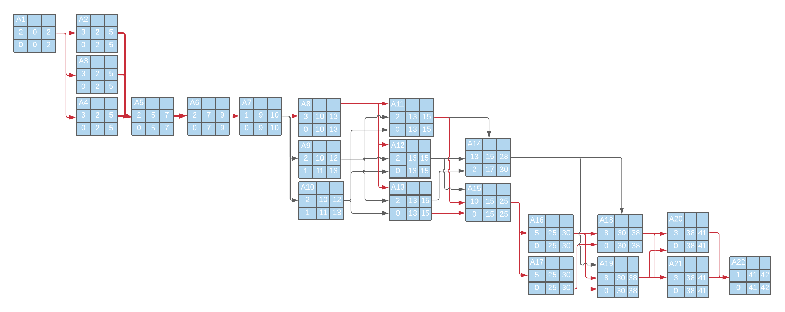
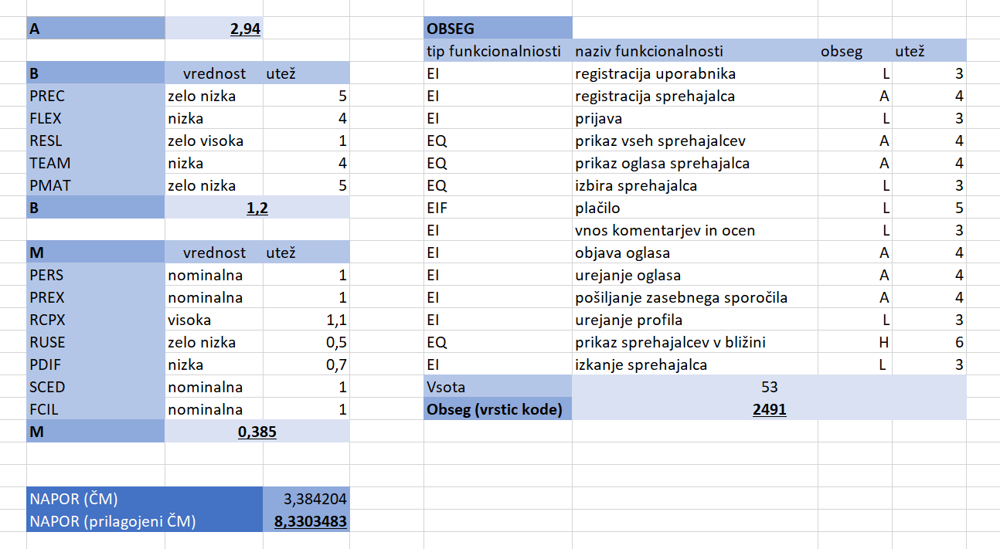

# Predlog projekta

|                    |             |
| :----------------- | :---------- |
| **Naziv projekta** | Dog Walkers |

## Povzetek projekta

Sedaj, ko se je tempo življenja v času epidemije covid-19 malo upočasnil, mnogo ljudi preživi veliko več časa doma. Menijo, da je zdaj morda primeren čas za posvojitev kakšne domače živali, saj lahko več časa namenijo skrbi in vzgajanju le-te. Kaj pa se bo zgodilo, ko se bo življenje vrnilo na stare tirnice in bodo spet morali v službo, kdo bo takrat skrbel za domače živali? Veliko ljudi pa si morda želi samo ukvarjati se z živalmi, ne želijo pa jih posvojiti, ker je to za njih prevelika odgovornost, zato mi ponujamo rešitev. Uporabniki, ki bodo preživeli veliko časa zdoma, bodo lahko na naši platformi izbrali primerno osebo, ki bo skrbela za njihove živali, medtem ko bodo oni zdoma ali pa zaradih drugih razlogov nimajo dovolj časa za skrb hišnih ljubljenčkov. Aplikacija bo vsebovala intuitiven uporabniški vmesnik, ki bo omogočal enostavno iskanje primernih skrbnikov, skrbniki pa bodo lahko preprosto objavili svoje oglase za čuvanje živali.

## 1. Projektna ideja

### 1.1 Ozadje

Vsak lastnik psov in drugih malih živali bo prej ali slej prišel v situacijo, ko mu bo zaradi drugih obveznosti zmanjkalo časa za skrb svojega hišnega ljubljenčka. Mnogi se v tem primeru obrnejo na sorodnike ali prijatelje, vendar pa vsi nimajo te možnosti. Delno rešitev predstavljajo tako imenovani "pasji hoteli". V teh lahko svojega ljubljenčka pustite v oskrbi, v primeru daljše odsotnosti. Žal pa le peščica takšnih ustanov ponuja tudi enodnevno oz. kratko oskrbo, ki jo potrebuje večina lastnikov.

### 1.2 Področje in motivacija

Zaradi nepremišljenega nakupa hišnega ljubljenčka in kasnejše ugotovitve, da zanj nimamo več časa, se marsikateri kuža znajde v zavetišču. Želimo razviti spletno rešitev, ki bi lastnikom s pomanjkanjem časa omogočila, da si najdejo zainteresirane sprehajalce, ki bi za njihovega hišnega ljubljenčka poskrbeli za eno popoldne ali pa za nekaj dni. Klasičen pristop reševanja tega problema je bil do sedaj preko poznanstev ampake se zavedamo, da marsikdo nima te možnosti, ali pa preko socialnih omrežij. Zato želimo vsakega lastnika, ki potrebuje pomoč pri sprehajanju svojega psa, predlagati čim večjem številu ljudi, ki imajo namen nuditi takšno pomoč, saj lahko s tem kar se da povečamo možnost oblikovanja novega stika.

### 1.3 Namen

- Omogočiti lastnikom psov registracijo in objavo oglasov,
- omogočiti skrbnikom registracijo in objavo svojih storitev,
- omogočiti iskanje potencialnih oglasov v relativni bližini,
- predstavitev oglasov čim večji množici uporabnikov,
- zmanjšanje potrebnih korakov pri iskanju osebe, pripravljene poskrbeti za tujega psa,
- oddaja ljubljenčkov osebam, ki imajo tovrstne izkušnje.

### 1.4 Cilji

- Delujoča spletna aplikacija, ki opravi vse teste,
- delujoča mobilna aplikacija, ki opravi vse teste,
- tehnična dokumentacija (aplikacija, podatkovna baza),
- API, ki ga lahko uporabljajo zunanji uporabniki,
- navodila za uporabo sistema,
- vsaj 50 objavljenih oglasov v prvem mesecu,
- vsaj 100 dnevnih uporabnikov po prvih 6 mesecih.

### 1.5 Smernice za rešitev

- Preprost in odziven spletni in aplikacijski uporabniški vmesnik,
- spletna stran in mobilna aplikacija morata biti sinhronizirani,
- spoštovanje zasebnosti podatkov uporabnikov,
- logotip mora biti smiselen in vizualno prijeten,
- rešitev mora biti skalabilna.

### 1.6 Končni uporabniki

- Ljubitelji psov vseh starosti, ki bi radi v svojem prostem času sprehajali pse,
- lastniki psov vseh starosti, ki nimajo časa in bi zaupali svojega psa ostalim uporabnikom,
- od uporabnikov niso zahtevena dodatna znanja, zaželjeno pa je, da so računalniško pismeni oz. imajo osnovno poznavanje spletnih omrežij,
- od uporabnikov je pričakovano osnovno znanje uporabe mobilnega telefona in računalnika,
- koristi od projekta bodo imela tudi zavetišča, saj bo manj živali končalo v zavetiščih in bodo zato lahko svoja sredstva namenili pomoči drugim.

## 2. Projektni načrt

### 2.1 Povzetek razdelitve projekta na aktivnosti

- Narediti načrt dela in smiselno organizirati ekipo, da vsak član pozna svoje zadolžitve.
- Zajem zahtev uporabnikov, ki bodo svoje pse sposojali. Ustvariti si seznam in smiselen model vseh povezujočih se zahtev.
- Zajem zahtev uporabnikov, ki si bodo pse sposojali. Ustvariti si seznam in smiselen model vseh povezujočih se zahtev.
- Analiza administrativnih zahtev, katerim se mora končni produkt pokoravati.
- Analiza potencialnih groženj in izdelovanje zahtev, katerim mora končni produkt slediti iz vidika varnosti.
- Organizacija in razdelitev dela.
- Združevanje vseh do sedaj zbranih zahtev in oblikovanje modela, kjer se zahteve med seboj ne bodo izključevale (Končni izdelek bo spletna aplikacija, izdelana v MEAN skladu z dodatno SQL bazo).
- Izbira oblike končnega izdelka. Glede na potrebe je potrebno določiti, ali bo izdelek mobilna aplikacija, spletna stran, nativna aplikacija ali več predhodno naštetih.
- Definiranje naloge 1. podatkovne baze. Izbira arhitekture in načina shranjevanja podatkov (SQL podatkovna baza za shranjevanje šifriranih osebnih podatkov uporabnikov).
- Definiranje naloge 2. podatkovne baze. Izbira arhitekture in načina shranjevanja podatkov (MongoDB podatkovna baza za shranjevanje ostalin neobčutljivoh podatkov, za lažje skaliranje).
- Osnutek izgleda čelnega končnega produkta.
- Definiranje oblike API klicev na zaledni del končnega produkta.
- Dogovor in zasnova načina avtentikacije uporabnikov.
- Izdelava čelnega dela aplikacije oz. spletne strani.
- Izdelava zalednega dela aplikacije oz. spletne strani.
- Vzpostavitev, definicija strukture podatkov in povezovanje s 1. podatkovno bazo.
- Vzpostavitev, definicija strukture podatkov in povezovanje z 2. podatkovno bazo.
- Objava končnega izdelka na mestu za gostovanje (spletna stran ali trgovina aplikacij).
- Testiranje uporabniškega vmesnika aplikacije oz. spletne strani.
- Testiranje delovanja zalednega dela aplikacije oz. spletne strani.
- Testiranje delovanja 1. podatkovne baze.
- Testiranje delovanja 2. podatkovne baze.

### 2.2 Načrt posameznih aktivnosti

| **Oznaka aktivnosti**                               | A1                                                                                         |
| :-------------------------------------------------- | :----------------------------------------------------------------------------------------- |
| **Predvideni datum pričetka izvajanja aktivnosti**  | 22. 3. 2020                                                                                |
| **Predvideni datum zaključka izvajanja aktivnosti** | 23. 3. 2020                                                                                |
| **Trajanje**                                        | 2                                                                                          |
| **Naziv aktivnosti**                                | Organizacija projekta                                                                      |
| **Obseg aktivnosti v ČM**                           | 0.5                                                                                        |
| **Seznam ciljev aktivnosti (kaj želite doseči)**    | Organizirana ekipa                                                                         |
| **Opis aktivnosti**                                 | Narediti načrt delanja in organizirati ekipo, da vsak ve na katerem delu projekta bo delal |
| **Morebitne odvisnosti in omejitve**                | /                                                                                          |
| **Pričakovani rezultati aktivnosti**                | Narejen delovni načrt in organizirana ekipa                                                |

 
 

| **Oznaka aktivnosti**                               | A2                                                            |
| :-------------------------------------------------- | :------------------------------------------------------------ |
| **Predvideni datum pričetka izvajanja aktivnosti**  | 24. 3. 2020                                                   |
| **Predvideni datum zaključka izvajanja aktivnosti** | 26. 3. 2020                                                   |
| **Trajanje**                                        | 3                                                             |
| **Naziv aktivnosti**                                | Zajem zahtev uporabnikov, ki bodo svoje pse posojali          |
| **Obseg aktivnosti v ČM**                           | 0.3                                                           |
| **Seznam ciljev aktivnosti (kaj želite doseči)**    | Ustvariti seznam in smiselen model vseh povezujočih se zahtev |
| **Opis aktivnosti**                                 | Ankete, izpraševali potencialne uporabnike                    |
| **Morebitne odvisnosti in omejitve**                | A1                                                            |
| **Pričakovani rezultati aktivnosti**                | Seznam in model zahtev                                        |

 
 

| **Oznaka aktivnosti**                               | A3                                                            |
| :-------------------------------------------------- | :------------------------------------------------------------ |
| **Predvideni datum pričetka izvajanja aktivnosti**  | 24. 3. 2020                                                   |
| **Predvideni datum zaključka izvajanja aktivnosti** | 26. 3. 2020                                                   |
| **Trajanje**                                        | 3                                                             |
| **Naziv aktivnosti**                                | Zajem zahtev uporabnikov, ki si bodo pse sposojali            |
| **Obseg aktivnosti v ČM**                           | 0.3                                                           |
| **Seznam ciljev aktivnosti (kaj želite doseči)**    | Ustvariti seznam in smiselen model vseh povezujočih se zahtev |
| **Opis aktivnosti**                                 | Ankete, izpraševali potencialne uporabnike                    |
| **Morebitne odvisnosti in omejitve**                | A1                                                            |
| **Pričakovani rezultati aktivnosti**                | Seznam in model zahtev                                        |

 
 

| **Oznaka aktivnosti**                               | A4                                                                  |
| :-------------------------------------------------- | :------------------------------------------------------------------ |
| **Predvideni datum pričetka izvajanja aktivnosti**  | 24. 3. 2020                                                         |
| **Predvideni datum zaključka izvajanja aktivnosti** | 26. 3. 2020                                                         |
| **Trajanje**                                        | 3                                                                   |
| **Naziv aktivnosti**                                | Analiza administrativnih zahtev                                     |
| **Obseg aktivnosti v ČM**                           | 0.1                                                                 |
| **Seznam ciljev aktivnosti (kaj želite doseči)**    | Razumevanje administrativnih zahtev                                 |
| **Opis aktivnosti**                                 | Analizirali administrativne zahteve                                 |
| **Morebitne odvisnosti in omejitve**                | A1                                                                  |
| **Pričakovani rezultati aktivnosti**                | Razumevanje administrativnih zahtev, ki se tičejo končnega produkta |

 
 

| **Oznaka aktivnosti**                               | A5                                                                                                         |
| :-------------------------------------------------- | :--------------------------------------------------------------------------------------------------------- |
| **Predvideni datum pričetka izvajanja aktivnosti**  | 29. 3. 2020                                                                                                |
| **Predvideni datum zaključka izvajanja aktivnosti** | 30. 3. 2020                                                                                                |
| **Trajanje**                                        | 2                                                                                                          |
| **Naziv aktivnosti**                                | Analiza potencialnih groženj in izdelovanje zahtev, katerim mora končni produkt slediti iz vidika varnosti |
| **Obseg aktivnosti v ČM**                           | 0.5                                                                                                        |
| **Seznam ciljev aktivnosti (kaj želite doseči)**    | Ustvariti seznam groženj in zahtev                                                                         |
| **Opis aktivnosti**                                 | Predvidevanje potencialnih varnostnih groženj                                                              |
| **Morebitne odvisnosti in omejitve**                | A2, A3, A4                                                                                                 |
| **Pričakovani rezultati aktivnosti**                | Seznam groženj in zahtev                                                                                   |

 
 

| **Oznaka aktivnosti**                               | A6                                                             |
| :-------------------------------------------------- | :------------------------------------------------------------- |
| **Predvideni datum pričetka izvajanja aktivnosti**  | 31. 3. 2020                                                    |
| **Predvideni datum zaključka izvajanja aktivnosti** | 1. 4. 2020                                                     |
| **Trajanje**                                        | 2                                                              |
| **Naziv aktivnosti**                                | Združevanje vseh do sedaj zbranih zahtev in oblikovanje modela |
| **Obseg aktivnosti v ČM**                           | 0.5                                                            |
| **Seznam ciljev aktivnosti (kaj želite doseči)**    | Ustvariti popoln seznam zahtev in oblikovanje modela           |
| **Opis aktivnosti**                                 | Združevanje prej naštetih zahtev                               |
| **Morebitne odvisnosti in omejitve**                | A5                                                             |
| **Pričakovani rezultati aktivnosti**                | Celoten seznam neizključujočih zahtev                          |

 
 

| **Oznaka aktivnosti**                               | A7                                                                                                                                                                                                               |
| :-------------------------------------------------- | :--------------------------------------------------------------------------------------------------------------------------------------------------------------------------------------------------------------- |
| **Predvideni datum pričetka izvajanja aktivnosti**  | 2. 4. 2020                                                                                                                                                                                                       |
| **Predvideni datum zaključka izvajanja aktivnosti** | 2. 4. 2020                                                                                                                                                                                                       |
| **Trajanje**                                        | 1                                                                                                                                                                                                                |
| **Naziv aktivnosti**                                | Organizacija in razdelitev dela                                                                                                                                                                                  |
| **Obseg aktivnosti v ČM**                           | 0.1                                                                                                                                                                                                              |
| **Seznam ciljev aktivnosti (kaj želite doseči)**    | Določiti kateri član ekipe bo sodeloval pri določeni aktivnosti v fazi načrtovanja in implementacije produkta.                                                                                                   |
| **Opis aktivnosti**                                 | Glede na določen tip izdelka je potrebno postaviti organizacijo dela v fazi implementacije produkta. Potrebno delo je treba čim bolj enakomerno razdeliti med člane ekipe glede na njihove sposobnosti in želje. |
| **Morebitne odvisnosti in omejitve**                | A6                                                                                                                                                                                                               |
| **Pričakovani rezultati aktivnosti**                | Razdeljeno delo                                                                                                                                                                                                  |

 
 

| **Oznaka aktivnosti**                               | A8                                                                                                                                       |
| :-------------------------------------------------- | :--------------------------------------------------------------------------------------------------------------------------------------- |
| **Predvideni datum pričetka izvajanja aktivnosti**  | 5. 4. 2020                                                                                                                               |
| **Predvideni datum zaključka izvajanja aktivnosti** | 7. 4. 2020                                                                                                                               |
| **Trajanje**                                        | 3                                                                                                                                        |
| **Naziv aktivnosti**                                | Oblikovanje končnega izdelka                                                                                                             |
| **Obseg aktivnosti v ČM**                           | 0.3                                                                                                                                      |
| **Seznam ciljev aktivnosti (kaj želite doseči)**    | Končan izgled in tip aplikacije                                                                                                          |
| **Opis aktivnosti**                                 | Glede na potrebe je potrebno določiti, ali bo izdelek mobilna aplikacija, spletna stran, nativna aplikacija, ali več predhodno naštetih. |
| **Morebitne odvisnosti in omejitve**                | A7                                                                                                                                       |
| **Pričakovani rezultati aktivnosti**                | Določen tip in oblika aplikacije                                                                                                         |

 

 

| **Oznaka aktivnosti**                               | A9                                                                                            |
| :-------------------------------------------------- | :-------------------------------------------------------------------------------------------- |
| **Predvideni datum pričetka izvajanja aktivnosti**  | 5. 4. 2020                                                                                    |
| **Predvideni datum zaključka izvajanja aktivnosti** | 6. 4. 2020                                                                                    |
| **Trajanje**                                        | 2                                                                                             |
| **Naziv aktivnosti**                                | Definiranje naloge 1. podatkovne baze in način shranjevanja                                   |
| **Obseg aktivnosti v ČM**                           | 0.1                                                                                           |
| **Seznam ciljev aktivnosti (kaj želite doseči)**    | Izbrana arhitektura in način shranjevanja podatkov 1. PB                                      |
| **Opis aktivnosti**                                 | Premislili, katera arhitektura PB in način shranjevanja podatkov bo najbolj ustrezen za 1. PB |
| **Morebitne odvisnosti in omejitve**                | A7                                                                                            |
| **Pričakovani rezultati aktivnosti**                | Določena arhitektura in način shranjevanja 1. PB                                              |

 
 

| **Oznaka aktivnosti**                               | A10                                                                                           |
| :-------------------------------------------------- | :-------------------------------------------------------------------------------------------- |
| **Predvideni datum pričetka izvajanja aktivnosti**  | 5. 4. 2020                                                                                    |
| **Predvideni datum zaključka izvajanja aktivnosti** | 6. 4. 2020                                                                                    |
| **Trajanje**                                        | 2                                                                                             |
| **Naziv aktivnosti**                                | Definiranje naloge 2. podatkovne baze in način shranjevanja                                   |
| **Obseg aktivnosti v ČM**                           | 0.1                                                                                           |
| **Seznam ciljev aktivnosti (kaj želite doseči)**    | Izbrana arhitektura in način shranjevanja podatkov 2. PB                                      |
| **Opis aktivnosti**                                 | Premislili, katera arhitektura PB in način shranjevanja podatkov bo najbolj ustrezen za 2. PB |
| **Morebitne odvisnosti in omejitve**                | A7                                                                                            |
| **Pričakovani rezultati aktivnosti**                | Določena arhitektura in način shranjevanja 2. PB                                              |

 
 

| **Oznaka aktivnosti**                               | A11                                       |
| :-------------------------------------------------- | :---------------------------------------- |
| **Predvideni datum pričetka izvajanja aktivnosti**  | 8. 4. 2020                                |
| **Predvideni datum zaključka izvajanja aktivnosti** | 9. 4. 2020                                |
| **Trajanje**                                        | 2                                         |
| **Naziv aktivnosti**                                | Osnutek izgleda čelnega končnega produkta |
| **Obseg aktivnosti v ČM**                           | 0.2                                       |
| **Seznam ciljev aktivnosti (kaj želite doseči)**    | Približen izgled aplikacije               |
| **Opis aktivnosti**                                 | Oblikovanje izgleda aplikacije            |
| **Morebitne odvisnosti in omejitve**                | A8, A9, A10                               |
| **Pričakovani rezultati aktivnosti**                | Osnutek izgleda aplikacije                |

 
 

| **Oznaka aktivnosti**                               | A12                                                            |
| :-------------------------------------------------- | :------------------------------------------------------------- |
| **Predvideni datum pričetka izvajanja aktivnosti**  | 8. 4. 2020                                                     |
| **Predvideni datum zaključka izvajanja aktivnosti** | 9. 4. 2020                                                     |
| **Trajanje**                                        | 2                                                              |
| **Naziv aktivnosti**                                | Definiranje oblike API klicev                                  |
| **Obseg aktivnosti v ČM**                           | 0.1                                                            |
| **Seznam ciljev aktivnosti (kaj želite doseči)**    | Oblika API klica                                               |
| **Opis aktivnosti**                                 | Definiranje oblike API klicev na zaledni del končnega produkta |
| **Morebitne odvisnosti in omejitve**                | A8, A9, A10                                                    |
| **Pričakovani rezultati aktivnosti**                | Delujoči API klici                                             |

 
 

| **Oznaka aktivnosti**                               | A13                                                 |
| :-------------------------------------------------- | :-------------------------------------------------- |
| **Predvideni datum pričetka izvajanja aktivnosti**  | 8. 4. 2020                                          |
| **Predvideni datum zaključka izvajanja aktivnosti** | 9. 4. 2020                                          |
| **Trajanje**                                        | 2                                                   |
| **Naziv aktivnosti**                                | Način avtentikacije uporabnikov                     |
| **Obseg aktivnosti v ČM**                           | 0.1                                                 |
| **Seznam ciljev aktivnosti (kaj želite doseči)**    | Določen način avtentikacije uporabnikov             |
| **Opis aktivnosti**                                 | Dogovor in zasnova načina avtentikacije uporabnikov |
| **Morebitne odvisnosti in omejitve**                | A8, A9                                              |
| **Pričakovani rezultati aktivnosti**                | Delujoča avtentikacija uporabnikov                  |

 
 

| **Oznaka aktivnosti**                               | A14                                              |
| :-------------------------------------------------- | :----------------------------------------------- |
| **Predvideni datum pričetka izvajanja aktivnosti**  | 12. 4. 2020                                      |
| **Predvideni datum zaključka izvajanja aktivnosti** | 28. 4. 2020                                      |
| **Trajanje**                                        | 13                                               |
| **Naziv aktivnosti**                                | Izdelava čelnega dela aplikacije                 |
| **Obseg aktivnosti v ČM**                           | 1.2                                              |
| **Seznam ciljev aktivnosti (kaj želite doseči)**    | Delujoč čelni del aplikacije                     |
| **Opis aktivnosti**                                 | Potrebno določiti izgled čelnega dela aplikacije |
| **Morebitne odvisnosti in omejitve**                | A11, A12, A13                                    |
| **Pričakovani rezultati aktivnosti**                | Delujoč čelni del aplikacije                     |

 
 

| **Oznaka aktivnosti**                               | A15                                      |
| :-------------------------------------------------- | :--------------------------------------- |
| **Predvideni datum pričetka izvajanja aktivnosti**  | 12. 4. 2020                              |
| **Predvideni datum zaključka izvajanja aktivnosti** | 23. 4. 2020                              |
| **Trajanje**                                        | 10                                       |
| **Naziv aktivnosti**                                | Izdelava zalednega dela aplikacije       |
| **Obseg aktivnosti v ČM**                           | 0.9                                      |
| **Seznam ciljev aktivnosti (kaj želite doseči)**    | Delujoč zaledni del aplikacije           |
| **Opis aktivnosti**                                 | Potrebno izdelati zaledni del aplikacije |
| **Morebitne odvisnosti in omejitve**                | A11, A12, A13                            |
| **Pričakovani rezultati aktivnosti**                | Delujoč zaledni del aplikacije           |

 
 

| **Oznaka aktivnosti**                               | A16                                                                             |
| :-------------------------------------------------- | :------------------------------------------------------------------------------ |
| **Predvideni datum pričetka izvajanja aktivnosti**  | 26. 4. 2020                                                                     |
| **Predvideni datum zaključka izvajanja aktivnosti** | 30. 4. 2020                                                                     |
| **Trajanje**                                        | 5                                                                               |
| **Naziv aktivnosti**                                | Povezovanje s 1. podatkovno bazo                                                |
| **Obseg aktivnosti v ČM**                           | 0.3                                                                             |
| **Seznam ciljev aktivnosti (kaj želite doseči)**    | Vzpostavljena delujoča povezava s 1. PB in določena oblika podatkov             |
| **Opis aktivnosti**                                 | Vzpostavitev, definicija strukture podatkov in povezovanje s 1. podatkovno bazo |
| **Morebitne odvisnosti in omejitve**                | A15                                                                             |
| **Pričakovani rezultati aktivnosti**                | Povezan zaledni del s 1. PB                                                     |

 
 

| **Oznaka aktivnosti**                               | A17                                                                             |
| :-------------------------------------------------- | :------------------------------------------------------------------------------ |
| **Predvideni datum pričetka izvajanja aktivnosti**  | 26. 4. 2020                                                                     |
| **Predvideni datum zaključka izvajanja aktivnosti** | 30. 4. 2020                                                                     |
| **Trajanje**                                        | 5                                                                               |
| **Naziv aktivnosti**                                | Povezovanje z 2. podatkovno bazo                                                |
| **Obseg aktivnosti v ČM**                           | 0.3                                                                             |
| **Seznam ciljev aktivnosti (kaj želite doseči)**    | Vzpostavljena delujoča povezava z 2. PB in določena oblika podatkov             |
| **Opis aktivnosti**                                 | Vzpostavitev, definicija strukture podatkov in povezovanje z 2. podatkovno bazo |
| **Morebitne odvisnosti in omejitve**                | A15                                                                             |
| **Pričakovani rezultati aktivnosti**                | Povezan zaledni del z 2. PB                                                     |

 
 

| **Oznaka aktivnosti**                               | A18                                                                       |
| :-------------------------------------------------- | :------------------------------------------------------------------------ |
| **Predvideni datum pričetka izvajanja aktivnosti**  | 3. 5. 2020                                                                |
| **Predvideni datum zaključka izvajanja aktivnosti** | 12. 5. 2020                                                               |
| **Trajanje**                                        | 8                                                                         |
| **Naziv aktivnosti**                                | Testiranje uporabniškega vmesnika                                         |
| **Obseg aktivnosti v ČM**                           | 1                                                                         |
| **Seznam ciljev aktivnosti (kaj želite doseči)**    | Brezhibnost uporabniškega vmesnika                                        |
| **Opis aktivnosti**                                 | Testiranje delovanja čelnega dela aplikacije in ugotovitev pomankljivosti |
| **Morebitne odvisnosti in omejitve**                | A16, A17                                                                  |
| **Pričakovani rezultati aktivnosti**                | Brezhiben uporabniški vmesnik oz. odkrite napake                          |

 
 

| **Oznaka aktivnosti**                               | A19                                            |
| :-------------------------------------------------- | :--------------------------------------------- |
| **Predvideni datum pričetka izvajanja aktivnosti**  | 3. 5. 2020                                     |
| **Predvideni datum zaključka izvajanja aktivnosti** | 12. 5. 2020                                    |
| **Trajanje**                                        | 8                                              |
| **Naziv aktivnosti**                                | Testiranje zalednega dela aplikacije           |
| **Obseg aktivnosti v ČM**                           | 1                                              |
| **Seznam ciljev aktivnosti (kaj želite doseči)**    | Brezhibno delovanje zalednega dela aplikacije  |
| **Opis aktivnosti**                                 | Testiranje delovanje zalednega dela aplikacije |
| **Morebitne odvisnosti in omejitve**                | A16, A17                                       |
| **Pričakovani rezultati aktivnosti**                | Brezhibno delovanje zalednega dela aplikacije  |

 
 

| **Oznaka aktivnosti**                               | A20                                     |
| :-------------------------------------------------- | :-------------------------------------- |
| **Predvideni datum pričetka izvajanja aktivnosti**  | 13. 5. 2020                             |
| **Predvideni datum zaključka izvajanja aktivnosti** | 17. 5. 2020                             |
| **Trajanje**                                        | 3                                       |
| **Naziv aktivnosti**                                | Testiranje delovanje 1. podatkovne baze |
| **Obseg aktivnosti v ČM**                           | 0.2                                     |
| **Seznam ciljev aktivnosti (kaj želite doseči)**    | Delovanje 1. podatkovne baze            |
| **Opis aktivnosti**                                 | Testiranje delovanje 1. podatkovne baze |
| **Morebitne odvisnosti in omejitve**                | A18, A19                                |
| **Pričakovani rezultati aktivnosti**                | Brezhibno delovanje 1. PB               |

 
 

| **Oznaka aktivnosti**                               | A21                                     |
| :-------------------------------------------------- | :-------------------------------------- |
| **Predvideni datum pričetka izvajanja aktivnosti**  | 13. 5. 2020                             |
| **Predvideni datum zaključka izvajanja aktivnosti** | 17. 5. 2020                             |
| **Trajanje**                                        | 3                                       |
| **Naziv aktivnosti**                                | Testiranje delovanje 2. podatkovne baze |
| **Obseg aktivnosti v ČM**                           | 0.2                                     |
| **Seznam ciljev aktivnosti (kaj želite doseči)**    | Delovanje 2. podatkovne baze            |
| **Opis aktivnosti**                                 | Testiranje delovanje 2. podatkovne baze |
| **Morebitne odvisnosti in omejitve**                | A18, A19                                |
| **Pričakovani rezultati aktivnosti**                | Brezhibno delovanje 2. PB               |

 
 

| **Oznaka aktivnosti**                               | A22                                                                                   |
| :-------------------------------------------------- | :------------------------------------------------------------------------------------ |
| **Predvideni datum pričetka izvajanja aktivnosti**  | 18. 5. 2020                                                                           |
| **Predvideni datum zaključka izvajanja aktivnosti** | 18. 5. 2020                                                                           |
| **Trajanje**                                        | 1                                                                                     |
| **Naziv aktivnosti**                                | Objava končnega izdelka na mestu za gostovanje                                        |
| **Obseg aktivnosti v ČM**                           | 0.1                                                                                   |
| **Seznam ciljev aktivnosti (kaj želite doseči)**    | Končni izdelek objavljen na mestu za gostovanje                                       |
| **Opis aktivnosti**                                 | Objava končnega izdelka na mestu za gostovanje (spletna stran ali trgovina aplikacij) |
| **Morebitne odvisnosti in omejitve**                | A20, A21                                                                              |
| **Pričakovani rezultati aktivnosti**                | Aplikacija objavljena na mestu za gostovanje                                          |

 

### 2.3 Seznam izdelkov

| Oznaka izdelka | Ime izdelka                                           | Datum izdaje |
| :------------- | :---------------------------------------------------- | :----------- |
| I1             | Delovni načrt                                         | 23.3.2020    |
| I2             | Seznam zahtev uporabnikov, ki bodo svoje pse posojali | 26.3.2020    |
| I3             | Model zahtev uporabnikov, ki bodo svoje pse posojali  | 26.3.2020    |
| I4             | Seznam zahtev uporabnikov, ki bodo pse sprehajali     | 26.3.2020    |
| I5             | Model zahtev uporabnikov, ki bodo pse sprehajali      | 26.3.2020    |
| I6             | Seznam administrativnih zahtev                        | 26.3.2020    |
| I7             | Seznam potencialnih varnostnih groženj in zahtev      | 30.3.2020    |
| I8             | Celoten seznam neizključujočih zahtev                 | 1.4.2020     |
| I9             | Osnutek aplikacije                                    | 7.4.2020     |
| I10            | Približen izgled aplikacije                           | 9.4.2020     |
| I11            | API klic                                              | 9.4.2020     |
| I12            | Avtentikacija uporabnikov                             | 9.4.2020     |
| I13            | Zaledni del aplikacije                                | 23.4.2020    |
| I14            | Čelni del aplikacije                                  | 28.4.2020    |
| I15            | Povezava med 1. PB in zalednim delom aplikacije       | 30.4.2020    |
| I16            | Povezava med 2. PB in zalednim delom aplikacije       | 30.4.2020    |

### 2.4 Časovni potek projekta - Ganttov diagram

### 2.5 Odvisnosti med aktivnosti - Graf PERT

Graf PERT prikazuje odvisnosti med aktivnostmi, trajanje aktivnosti in količino drsenja posamezne aktivnosti.

## 3. Obvladovanje tveganj

### 3.1 Identifikacija in analiza tveganj

Tabela tveganj:

| Naziv tveganja                             | Vpliva na          | Opis tveganja                                                                                                                      | Tip tveganja   | Verjetnost nastopa tveganja | Posledice nastopa tveganja |
| :----------------------------------------- | ------------------ | :--------------------------------------------------------------------------------------------------------------------------------- | :------------- | :-------------------------- | :------------------------- |
| Obseg dela podcenjen **(T1)**              | projekt in produkt | Celoten obseg dela smo podcenili in bo prišlo do zamude                                                                            | ocenjevanje    | zmerna                      | sprejemljive               |
| Obseg programske opreme podcenjen **(T2)** | projekt in produkt | Podcenili smo, koliko programske opreme bo potrebne za izdelavo aplikacije                                                         | ocenjevanje    | zmerna                      | sprejemljive               |
| Odsotnost člana **(T3)**                   | projekt            | Zaradi različnih razlogov član ekipe ni dosegljiv in ne more nadaljevati dela na projektu                                          | ljudje         | visoka                      | resne                      |
| Nemotiviranost članov **(T4)**             | projekt            | Člani počasneje napredujejo pri delu, ker jih le-to ne motivira dovolj                                                             | ljudje         | majhna                      | resne                      |
| Okvara strojne opreme **(T5)**             | projekt            | Kritična napaka strojne infrastrukture                                                                                             | orodja         | majhna                      | resne                      |
| Slaba orodja za testiranje **(T6)**        | produkt            | Izbrana orodja za testiranje aplikacije ne omogočajo dovolj dobrega testiranja, zato v aplikaciji ostanejo napake                  | orodja         | zmerna                      | resne                      |
| Konkurenčen produkt **(T7)**               | posel              | Na trg pride konkurenčen produkt preden mi izdamo svojega                                                                          | organizacijsko | zmerna                      | sprejemljive               |
| Razdelitev dela **(T8)**                   | projekt in produkt | Delo ni dobro razdeljeno med sodelujoče, posledica je lahko veliko čakanja en na drugega ali premalo/preveč dela za nekatere člane | organizacijsko | visoka                      | resne                      |
| Premalo zmogljiv strežnik **(T9)**         | projekt in produkt | Zaledni strežnik, ki servira aplikacijo, ni prilagojen za večje število uporabnikov, kar upočasni delovanje za končne uporabnike   | tehnologija    | majhna                      | sprejemljive               |
| Počasna podatkovne baza **(T10)**          | projekt in produkt | Izbrane podatkovne baze niso dobro prilagojene na operacije, ki se bodo na njih pogosto izvajale, posledica je počasno delovanje   | tehnologija    | majhna                      | sprejemljive               |
| Spremembe zahtev **(T11)**                 | projekt in produkt | Pojavijo se nove zahteve, ki zahtevajo veliko sprememb v izvorni kodi                                                              | zahteve        | zmerna                      | resne                      |
| Slabo definirane zahteve **(T12)**         | projekt in produkt | Zahteve niso dovolj dobro definirane, zato je delo oteženo in se aplikacija razvija počasneje                                      | zahteve        | visoka                      | resne                      |

### 3.2 Načrtovanje tveganj

Načrt za obvladovanje tveganj:

| Tveganje                                   | Strategija                                                                                                                                                                             |
| :----------------------------------------- | :------------------------------------------------------------------------------------------------------------------------------------------------------------------------------------- |
| Odsotnost člana **(T3)**                   | S preostalimi člani ekipe se bomo dogovorili kako bi bilo najlažje prevzeti delo odsotnega člana brez, da trpijo ostali aspekti projekta.                                              |
| Razdelitev dela **(T8)**                   | Vodja projekta skliče sestanek in ponovno razdeli delo glede na sedaj videne kompetence.                                                                                               |
| Slabo definirane zahteve **(T12)**         | Skliče se sestanek ekipe in stranke, ponovno se gre skozi zahteve, ki pa se natančneje definirajo.                                                                                     |
| Slaba orodja za testiranje **(T6)**        | Poiščejo se boljša orodja za testiranje, ki nimajo problemov, ki so jih povzročala dosedanja.                                                                                          |
| Spremembe zahtev **(T11)**                 | Skliče se sestanek ekipe in se dogovori, kako najbolj efektivno v projekt vpeljati nove/spremenjene zahteve.                                                                           |
| Nemotiviranost članov **(T4)**             | Pogovori s člani ekipe, da se ugotovi, zakaj niso motivirani in se ta problem poizkusi rešiti. Pomembno je tudi, da se člani pri delu dobro počutijo in imajo jasno zastavljene cilje. |
| Okvara strojne opreme **(T5)**             | Okvarjeno strojno opremo se zamenja z novo. Da se minimizira vpliv je aplikacija shranjena v oblaku s sistemi za upravljanje z izvorno kodo (Git).                                     |
| Obseg dela podcenjen **(T1)**              | Dogovor s stranko za podaljšanje dela ali pa zmanjšanje kompleksnosti aplikacije, da se jo lahko razvije pravočasno.                                                                   |
| Obseg programske opreme podcenjen **(T2)** | Potrebno pridobiti več programske opreme, kar lahko povzroči dodatne stroške. Če je možno, se uporabi prosto in odprtokodno programje (FOSS).                                          |
| Konkurenčen produkt **(T7)**               | Aplikacijo bomo dobro oglaševali in jo naredili uporabnikom čim bolj prijazno, da bojo raje uporabili našo.                                                                            |
| Premalo zmogljiv strežnik **(T9)**         | Strežnik bomo nadgradili ali pa prestavili aplikacijo na bolj zmogljiv strežnik.                                                                                                       |
| Počasna podatkovne baza **(T10)**          | Podatkovno bazo bomo zamenjali z drugo, ki bo bolj primerna operacijam, ki se pogosto izvajajo.                                                                                        |

## 4. Upravljanje projekta

Projekta se bomo lotili z zbiranjem zahtev potencialnih strank. Za dobro zasnovano aplikacijo so pomembne zahteve lastnikov psov, kot tudi zahteve sprehajalcev oz. skrbnikov.

Ker večja količina zbranih informacij pomeni lažje načrtovanje izdelka in boljšo uporabniško izkušnjo končnim uporabnikom, se bomo zbiranja podatkov lotili vsi člani ekipe. Prav tako bomo vsi člani sodelovali pri analizi administrativnih zahtev in analizi potencialnih groženj ter zajemu varnostnih zahtev, ki jih bo moral končni produkt pokriti. Skupaj bomo nato na podlagi zahtev strank in v skladu z varnostnimi zahtevami zasnovali končen izdelek.

Zaradi trenutne epidemiološke situacije bomo primorani vso skupinsko delo opravljati preko videokonferenčnih klicev. Tu gre predvsem za delo v fazi načrtovanja projekta, kjer bo potrebno uskladiti vse ideje s strani članov ekipe. Potrebna bo tudi smiselna porazdelitev dela med člani za nadaljnje faze projekta in sicer na tri segmente: izdelava čelnega dela, izdelava zalednega dela ter vzpostavitev in integracijo podatkovnih baz. Dodelitev posameznega člana ekipe v segment bo temeljila na znanju in izkušnjah članov, seveda pa bomo pri porazdelitvi upoštevali tudi želje vsakega posameznika.

| Oznaka aktivnosti | Naziv aktivnosti                                                                                           | 1. član | 2. član | 3. član | 4. član | 5. član |
| :---------------: | :--------------------------------------------------------------------------------------------------------- | :-----: | :-----: | :-----: | :-----: | :-----: |
|        A1         | Organizacija projekta                                                                                      |   20%   |   20%   |   20%   |   20%   |   20%   |
|        A2         | Zajem zahtev uporabnikov, ki bodo svoje pse posojali                                                       |   50%   |   50%   |   0%    |   0%    |   0%    |
|        A3         | Zajem zahtev uporabnikov, ki si bodo pse sposojali                                                         |   0%    |   0%    |   50%   |   50%   |   0%    |
|        A4         | Analiza administrativnih zahtev                                                                            |   0%    |   0%    |   0%    |   0%    |  100%   |
|        A5         | Analiza potencialnih groženj in izdelovanje zahtev, katerim mora končni produkt slediti iz vidika varnosti |   20%   |   20%   |   20%   |   20%   |   20%   |
|        A6         | Združevanje vseh do sedaj zbranih zahtev in oblikovanje modela                                             |   20%   |   20%   |   20%   |   20%   |   20%   |
|        A7         | Organizacija in razdelitev dela                                                                            |   20%   |   20%   |   20%   |   20%   |   20%   |
|        A8         | Oblikovanje končnega izdelka                                                                               |   35%   |   10%   |   10%   |   10%   |   35%   |
|        A9         | Definiranje naloge 1. podatkovne baze in način shranjevanja                                                |   0%    |   75%   |   25%   |   0%    |   0%    |
|        A10        | Definiranje naloge 2. podatkovne baze in način shranjevanja                                                |   0%    |   0%    |   25%   |   75%   |   0%    |
|        A11        | Osnutek izgleda čelnega končnega produkta                                                                  |   50%   |   0%    |   0%    |   0%    |   50%   |
|        A12        | Definiranje oblike API klicev                                                                              |   0%    |   0%    |   75%   |   25%   |   0%    |
|        A13        | Način avtentikacije uporabnikov                                                                            |   0%    |   75%   |   0%    |   25%   |   0%    |
|        A14        | Izdelava čelnega dela aplikacije                                                                           |   50%   |   0%    |   0%    |   0%    |   50%   |
|        A15        | Izdelava zalednega dela aplikacije                                                                         |   0%    |   25%   |   50%   |   25%   |   0%    |
|        A16        | Povezovanje s 1. podatkovno bazo                                                                           |   0%    |   75%   |   25%   |   0%    |   0%    |
|        A17        | Povezovanje z 2. podatkovno bazo                                                                           |   0%    |   0%    |   25%   |   75%   |   0%    |
|        A18        | Testiranje uporabniškega vmesnika                                                                          |   40%   |   0%    |   20%   |   0%    |   40%   |
|        A19        | Izdelava zalednega dela aplikacije                                                                         |   0%    |   40%   |   20%   |   40%   |   0%    |
|        A20        | Testiranje delovanje 1. podatkovne baze                                                                    |   0%    |   75%   |   25%   |   0%    |   0%    |
|        A21        | Testiranje delovanje 2. podatkovne baze                                                                    |   0%    |   0%    |   25%   |   75%   |   0%    |
|        A22        | Objava končnega izdelka na mestu za gostovanje                                                             |   0%    |   20%   |   60%   |   20%   |   0%    |

## 5. Predstavitev skupine

...

## 6. Finančni načrt - COCOMO II ocena

**Okvirna ocena časovne zahtevnosti projekta**

Napor = A * Obseg^B * M

2,94 * 2,491^1,2 * 0,385 = 3,384 ČM

Časovna zahtevnost našega projekta je 3,38 človek-mesecev (ČM) dela. Upoštevati pa moramo, da je 1 ČM pri članu naše ekipe mnogo manjši kot 1 ČM zaposlenega (160 ur / mesec). V našem primeru ta znaša 65 ur mesečno ali z drugimi besedami nekaj več kot 3 ure dela dnevno. Zgornja časovna zahtevnost se tako pretvori v 8,33 ČM.

**Finančni načrt po aktivnostih**

| Oznaka aktivnosti | Naziv aktivnosti                                                                                           | Obseg dela (človek-meseci) | predvideni stroški dela (€) | predvideni stroški investicij (€) | posredni stroški (€) | **skupni stroški (€)** |
| :---------------: | :--------------------------------------------------------------------------------------------------------- | :------------------------: | :-------------------------: | :-------------------------------: | :------------------: | :--------------------: |
|        A1         | Organizacija projekta                                                                                      |            0,5             |             325             |                 /                 |          49          |        **374**         |
|        A2         | Zajem zahtev uporabnikov, ki bodo svoje pse posojali                                                       |            0,3             |             195             |                 /                 |          29          |        **224**         |
|        A3         | Zajem zahtev uporabnikov, ki si bodo pse sposojali                                                         |            0,3             |             195             |                 /                 |          29          |        **224**         |
|        A4         | Analiza administrativnih zahtev                                                                            |            0,1             |             65              |                 /                 |          10          |         **75**         |
|        A5         | Analiza potencialnih groženj in izdelovanje zahtev, katerim mora končni produkt slediti iz vidika varnosti |            0,5             |             325             |                 /                 |          49          |        **374**         |
|        A6         | Združevanje vseh do sedaj zbranih zahtev in oblikovanje modela                                             |            0,5             |             325             |                 /                 |          49          |        **374**         |
|        A7         | Organizacija in razdelitev dela                                                                            |            0,1             |             65              |                80                 |          10          |        **155**         |
|        A8         | Oblikovanje končnega izdelka                                                                               |            0,3             |             195             |                 /                 |          29          |        **224**         |
|        A9         | Definiranje naloge 1. podatkovne baze in način shranjevanja                                                |            0,1             |             65              |                100                |          10          |        **175**         |
|        A10        | Definiranje naloge 2. podatkovne baze in način shranjevanja                                                |            0,1             |             65              |                100                |          10          |        **175**         |
|        A11        | Osnutek izgleda čelnega končnega produkta                                                                  |            0,2             |             130             |                 /                 |          20          |        **150**         |
|        A12        | Definiranje oblike API klicev                                                                              |            0,1             |             65              |                200                |          10          |        **275**         |
|        A13        | Način avtentikacije uporabnikov                                                                            |            0,1             |             65              |                 /                 |          10          |         **75**         |
|        A14        | Izdelava čelnega dela aplikacije                                                                           |            1,2             |             780             |                 /                 |         117          |        **897**         |
|        A15        | Izdelava zalednega dela aplikacije                                                                         |            0,9             |             585             |                 /                 |          88          |        **673**         |
|        A16        | Povezovanje s 1. podatkovno bazo                                                                           |            0,3             |             195             |                 /                 |          29          |        **224**         |
|        A17        | Povezovanje z 2. podatkovno bazo                                                                           |            0,3             |             195             |                 /                 |          29          |        **224**         |
|        A18        | Testiranje uporabniškega vmesnika                                                                          |             1              |             650             |                 /                 |          98          |        **747**         |
|        A19        | Testiranje zalednega dela aplikacije                                                                       |             1              |             650             |                 /                 |          98          |        **747**         |
|        A20        | Testiranje delovanje 1. podatkovne baze                                                                    |            0,2             |             130             |                 /                 |          20          |        **150**         |
|        A21        | Testiranje delovanje 2. podatkovne baze                                                                    |            0,2             |             130             |                 /                 |          20          |        **150**         |
|        A22        | Objava končnega izdelka na mestu za gostovanje                                                             |            0,1             |             65              |                10                 |          10          |         **85**         |

**Obrazložitev stroškov investicij**

| Oznaka aktivnosti | Naziv aktivnosti                                            | Opis stroška                                                                                                     | znesek (€) |
| :---------------: | :---------------------------------------------------------- | :--------------------------------------------------------------------------------------------------------------- | :--------: |
|        A7         | Oblikovanje končnega izdelka                                | Nakup licenc za razvojna orodja. Licenca za vsakega člana ekipe za obdobje 2 meseca (npr. WebStorm: 8 € / mesec) |     80     |
|        A9         | Definiranje naloge 1. podatkovne baze in način shranjevanja | Stroški gostovanja 1. podatkovne baze za obdobje 2 meseca (npr. MongoDb Atlas: 48 € / mesec)                     |    100     |
|        A10        | Definiranje naloge 2. podatkovne baze in način shranjevanja | Stroški gostovanja 2. podatkovne baze za obdobje 2 meseca                                                        |    100     |
|        A12        | Definiranje oblike API klicev                               | Stroški zunanjih API poizved (Google maps -> 2 € / 1000 req)                                                     |    200     |
|        A22        | Objava končnega izdelka na mestu za gostovanje              | Stroški gostovanja aplikacije na oblačnem strežniku (AWS)                                                        |     10     |

Za vsako aktivnost smo na podlagi predvidenega obesega dela izračunali tudi predvidene stroške dela. Za vse člane ekipe smo določili enotno urno postavko in sicer 10 € / uro.Poleg stroškov dela pa smo k stroškom aktivnosti prišteli še morebitne stroške investicij in druge posredne stroške. Za slednje smo predvideli da znašajo 15 % stroškov dela te aktivnosi. V izračun nismo vključili potnih stroškov, saj se zaradi trenutnih epidemioloških razmer v državi ekipa ne bo sestajala na skupni lokaciji, temveč bodo vsi sestanki potekali na daljavo.

Skupna vsota vseh stroškov aktivnosti tako znaša 6771 €.

## Reference

[1]: R. H. Thayer, E. Yourdon, **Software Engineering Project**, IEEE Computer Society, Los Alamitos, 2001.  
[2]: Lavbič Dejan, Tehnologija programske opreme 2020/2021, https://teaching.lavbic.net/TPO/2020-2021/

## :interrobang: Dodatni komentarji izvajalcev predmeta

**Problemska domena** projekta je bila **izbrana s pomočjo glasovanja** vseh študentov in izvajalcev pri predmetu TPO. To ne pomeni, da je predlagan projekt s tehnične plati brezhiben in da ne vsebuje napak oz. da je bil najbolje ocenjen. Pri vašem delu v okviru 2. LP, 3. LP in 4. LP vam tako opredeljuje zgolj problemsko domeno, ki jo lahko v nadaljevanju implementirate iz svojega zornega kota, kar pomeni, da bodo skupine dale poudarek na različne vidike sistema, ki ga bodo na koncu tudi implementirale.

Omenjen predlog projekta je takšen, kot ga je pripravila zmagovalna skupina, kjer so zgolj odstranjeni deli o sodelujočih članih projekta. Pri nadaljnjem delu tako bodite dodatno pozorni in odpravite naslednje pomanjkljivosti tega projektnega predloga:

* :exclamation: V okviru kompleksnosti projekta **ni omenjenih zunanjih sistemov**, zgolj en EIF in aktivnost vezana nanj. **Podatkovni bazi nista neposredno omenjeni**; sta sicer dve, v tabeli nimamo nobenih ILF.
* :exclamation: **Povzetki aktivnosti niso ustrezni**.
* :exclamation: **Aktivnosti niso ustrezno načrtovane**, in sicer aktivnosti A8, A9 in A10 ne upoštevajo praznika 5. 4. 2021, medtem ko aktivnosti A14 in A26 ne upoštevata praznika 27. 4. 2021. Prav tako izdelki niso ustrezno poimenovani.
* :exclamation: Pri Ganttovem diagramu so datumi v zgornjem delu slabo vidni. Prav tako bi morale biti aktivnosti v Ganttovem diagramu poimenovane, da lahko takoj vidimo, za katero gre. **Prazniki pri načrtovanju niso upoštevani.**
* :exclamation: Strategija pri tveganjih ni poimenovana.
* :exclamation: Ni jasno kakšna orodja se bo uporabljalo za usklajevanje dela pri upravljanju projekta.
* :exclamation: Pri finančnem načrtu **ni jasno, kako je ocenjen ČM aktivnosti**.