# Dokument zahtev

|                             |                                                         |
| :-------------------------- | :------------------------------------------------------ |
| **Naziv projekta**          | Walk Doggers |
| **Člani projektne skupine** | Matic Bregar, Domen Vilar, Timotej Petrič, Mustafa Grabus in Domen Bukovac |
| **Kraj in datum** | Ljubljana, 05.04.2021 |                              |

## Povzetek projekta
Zaradi hitrega tempa življenja današnje družbe, ljudje velikokrat zapostavljamo domače živali, za katere smo si na začetku, ko so prišle v naš dom vzeli veliko časa. 
Zaradi te težave bomo razvili aplikacijo, ki bo lastnikom psov, ki nimajo veliko prostega časa omogočila, da na enostaven način najdejo sprehajalca, ki svojega ljubljenčka še nima, ali pa se trenutno ne počuti dovolj sposobnega za vsakodnevno skrblenje za domačo žival.

Lastniki psov bodo lahko objavili oglase za sprehajanje psa, na katere se bodo lahko prijavili vsi zainteresirani. Med vsemi kandidati bodo lastniki izbrali najbolj primernega sprehajalca na podlagi profila te osebe ter pogovora preko sporočil. S tem želimo omogočiti, da bodo pasji ljubljenčki imeli primerno družbo. Hkrati bomo tudi zavetiščem ponuditi rešitev, da bodo njihovi psi preživeli več časa zunaj in hitreje našli nov dom. Sprehajalci, ki se trenutno še odločajo za psa, pa bodo lahko izkusili, kako je skrbeti za njih in imeti eno odgovornost več.

## 1. Uvod

Današnja družba je vsak trenutek dneva z nečim zaposlena in okupirana z vseh strani z mediji, oglasi, spletnimi omrežji, predvsem pa večino časa preživi v službi.
Čas je ena izmed najbolj pomembnih vrednot. Velikokrat ga zmanjka za kakšno opravilo ali aktivnost, pa čeprav je ta nujna. Ko lastniki psov spoznajo, da svojemu ljubljenčku ne morejo nuditi vsega, kar potrebuje, velikokrat le ta konča v zavetišču.

Naša aplikacija bo reševala problem zasedenih lastnikov psov, ki jim zaradi vseh obveznosti včasih zmanjka časa, da bi za njih skrbeli spodobno. Z aplikacijo želimo doseči, da se bodo zasedeni lastniki psov odločili za našo rešitev, namesto da dajo psa v zavetišče. S tem bomo razbremenili zasedenost pasjih zavetišč in poskrbeli, da bo čim več kosmatincev imelo topel dom, kjer se bodo počutili ljubljene in zaželene.

Aplikacija Walk Doggers bo omogočala uporabnikom, da bodo za svoje ljubljenčke ustvarili pasje profile, za katere bodo lahko ustvarili oglas za sprehod ali drugačno oskrbo, ko lastnik za to nima časa. Profil psa bi vseboval vse potrebne informacije o psu, torej kako mu je ime, kratek opis, težo ter slika psa. Prijavljena oseba ima svoj profil, na katerih bo vidna povprečna ocena osebe za lažje odločanje ali je potencialen sprehajalec oz. lastnik primeren. 

Oglas, ki ga bo objavil lastnik, bo vseboval informacije o psu, lokacijo, datum in uro termina. Vseboval bo tudi kratek opis oglasa, kjer bo lastnik lahko napisal pomembne informacije ali opombe. Oglase bo lahko videl prijavljeni ali neprijavljeni uporabnik, torej bodo javno dostopni vsem. Samo prijavljeni uporabniki se bodo lahko prijavljali na oglase. Oglasi bodo sortirani glede na oddaljenost lastnika. Pred dejanskim srečanjem in oddajo psa se bo sprehajalec v primeru dodatnih vprašanj najprej prijavil na oglas in nato tudi kontaktiral lastnika prek integriranega sporočilnega sistema.
Lokacija oglasa oz. sprehoda se bo samodejno pridobila pri procesu kreiranja oglasa. Naslov začetka sprehoda bo pridobljen iz pridobljenih koordinat prek zunanjega sistema Reverse Geocoding za pridobivanje naslovov iz koordinat.

Lastnik se bo izmed prijavljenih kandidatov po lastni presoji odločil za enega od sprehajalcev. Pomagal si bo lahko z oceno in pa tudi izmenjanimi sporočili. Izbranemu sprehajalcu bo sprehod odobril, vsi ostali potencialni kandidati, pa bodo na oglasu videli, da je njihova prošnja za sprehajanje zavrnjena.

Aplikacija bo prijavljenim ali neprijavljenim uporabnikom obogočala prebiranje objav na blogu. Na blog bodo lahko uporabniki z vlogo pisca objav objavljali nove zanimive objave. Objave bodo tematsko povezane predvsem s psi, njihovo nego in zanimivimi nasveti. Vsak prijavljen uporabnik bo lahko postal pisec bloga, in sicer s povišanjem samega sebe v Reporterja v razdelku Settings.

Ker v hitrem življenjskem slogu pogosto prihaja do nenadnih sprememb, in ne moremo vsega predvideti vnaprej, aplikacija omogoča tudi urejanje. Urejati bo mogoče profile psov in uporabnikov.

Omenili in deloma opisali smo že, da je **prijavljeni uporabnik** lahko v vlogi lastnika psa, ki bo za svojega psa iskal sprehajalce. Slednji bodo zaradi ljubezni do živali ali želje po oddihu v naravi iskali pse, da bi z njimi preživeli svoj prosti čas na svežem zraku. Svoje vtise in znanje o živalih bodo lahko delili tudi **pisci bloga** tako, da bodo svojo zgodbo objavili na naši platformi. Za vzdrževanje kakovostnih vsebin bodo skrbeli **moderatorji**, ki bodo potrjevali nove blog objave in **administratorji**, ki bodo brisali neprimerne oglase.

Aplikacija ima tudi kar nekaj nefunkcionalnih zahtev. Pri sami aplikaciji bomo poskrbeli, da bo aplikacija dostopna 24 ur na dan z izjemo izpadov na katere bomo pripravljeni in jih čim hitreje odpravili. Mora delovati nemoteno, kljub temu da jo bo sočasno uporabljalo par 100 uporabnikov, ki na posamezno zahtevo ne smejo čakati več kot 3 sekunde. Za uporabniško izkušnjo bomo poskrbeli tako, da bo uporabnik lahko prišel na kateri koli pogled v aplikaciji v manj kot petih klikih.

Zaupni podatki bodo na voljo samo razvijalski ekipi, ki bo za tekoče nemoteno delo uporabljala sistem Git in Kanban tablo.

Aplikacija ne sme biti žaljiva ter rasisitična, zato bodo morali naši moderatorji in admini takšne vsebine odstraniti v manj kot dnevu. Dostop do aplikacije bodo imeli vsi ljudje ter psi ne glede na raso ter pasmo. Hranjenje in deljenje podatkov pa bo skladno s slovensko zakonodajo ter evropsko GDPR ureditvijo.

## 2. Uporabniške vloge

V aplikaciji Walk Doggers obstaja 5 tipov uporabnikov: 
- **neprijavljen uporabnik**: Bo imel dostop do objavljenih oglasov in blogov, ki si jih bo lahko ogledal. Oglasov ne bo mogel objaviti ali se na njih prijaviti dokler si ne bo ustvaril uporabniškega računa. Prav tako to velja za objave na blogu, ki jih ne bo mogel pisati in objaviti. Dostop do vseh ostalih funkcionalnosti mu bo onemogočen dokler se ne bo registriral in prijavil.
- **prijavljen uporabnik (sprehajalec/lastnik)**: Ima na voljo vse funkcionalnosti enake kot neprijavljeni uporabnik. Lahko se sam poviša v pisca bloga. Poleg tega pa mu bo omogočeno objavljanje oglasov ter prijavljanje na oglase. Prijavljeni uporabniki si bodo lahko izmenjali sporočila in se dogovoril o vseh podrobnostih psa, srečanja, sprehoda itd. Lahko bo ocenil sprehajalca, če oddaja oglas oz. lastnika, če se je na oglas prijavil. Na enem mestu si bo lahko ogledal oglase na katere se je prijavil in oglase, ki jih oddaja. Imel bo tudi možnost urejanja, svojega profila in profila psov.
- **pisec bloga**: Ima na voljo vse funkcionalnost kot prijavljeni uporabnik. Poleg tega lahko še piše objave, ki so po odobritvi moderatorja vidne vsem uporabnikom v razdelku Blog.
- **moderator**: Ima na voljo vse funkcionalnosti kot prijavljen uporabnik. Poleg tega potrjuje objave piscov bloga. Preden so objave vidne prijavljenim in neprijavljenim uporabnikom, jih mora moderator potrditi.
- **administrator**: Ima na voljo vse funkcionalnosti kot prijavljen uporabnik. Lahko briše neprimerne oglase.

## 3. Slovar pojmov

| **Pojem** | **Opredelitev** |
| - | - | 
|email | e-poštni naslov
|sprehajalec | prijavljeni uporabnik, ki se je prijavil na oglas
|lastnik oglasa | prijavljeni uporabnik, ki je objavil oglas
|potrjeni oglas | lastnik oglasa je prijavljenega sprehajalca potrdil za oglas
|Reporter | imenovanje vloge pisca bloga, v katero se lahko poviša vsak prijavljen uporabnik v nastavitvah
|status Pending| status oglasa, ki pove, da lastnik oglasa še ni potrdil nobenega sprehajalca oz. sprehajalcu lastnik še ni potrdil prijave na oglas
|status Completed | status oglasa, ki pove, da je imel oglas potrjenega sprehajalca in je časovno potekel
|status Arranged | status oglasa, ki pove, da ima oglas potrjenega sprehajalca
|status Requested | status oglasa, ki pove, da se sprehajalec zanima za oglas
|status Listed | status oglasa
|status Finished | status oglasa, ki pove, da je oglas končan (status Completed) in sprehajalec oz. lastnik je ocenjen
|sporočilno okno | pogled v katerem dva prijavljena uporabnika lahko komunicirata med sabo
|lastnik | prijavljen uporabnik, ki ima objavljen vsaj en oglas
|sprehajalec | prijavljen uporabnik, ki se je prijavil na vsaj en oglas za sprehajanje psa
|razdelek | Glavni meniji aplikacije. Vseh razdelkov je pet (od leve proti desni): Explore, Inbox, Blog, Listings, Settings. |Smiselno ločujejo aplikacijo.
|razdelek Explore | prikazuje seznam oglasov
|razdelek Inbox | prikazuje sporočila z ostalimi uporabniki
|razdelek Blog | prikazuje seznam objav
|razdelek Listings | prikazuje seznam oglasov na katere smo se prijavili in seznam oglasov, ki smo jih objavili
|razdelek Settings | razdelek, kjer lahko prijavljen uporabnik ureja nastavitve svojega profila
|Filtrirno okno oglasov | prvo mesto v filtrirnem oknu zasede All Messages, nasledna pa so v časovnem zaporedju razporejeni oglasi od najnovejših do najstarejših med katerimi se premikamo z drsnim potegom
|Mehka prijava ali Soft apply | Ko sprehajalec kontaktira lastnika brez da bi se prijavil na oglas, se ustvari mehka prijava.

## 4. Diagram primerov uporabe

## 5. Funkcionalne zahteve

### F1 Registracija

Neprijavljen uporabnik se lahko registrira na strani. Ob registraciji vpiše ime, priimek, email in geslo.

#### Osnovni tok

1. Neprijavljen uporabnik izbere funkcionalnost registracija.
2. Aplikacija mu ponudi registracijski obrazec.
3. Neprijavljen uporabnik izpolni registracijski obrazec. Vpiše svoje ime, priimek, email in geslo. Geslo je dolgo vsaj 8 znakov in sestavljeno iz velikih in malih črk, številk ter vsaj enega posebnega znaka.
4. Neprijavljen uporabnik odda registracijski obrazec.
5. Aplikacija prikaže obvestilo o uspešni registraciji.

#### Alternativni tok

**Alternativni tok 1**

1. Neprijavljen uporabnik želi dostopati do funkcionalnosti, ki je na voljo le prijavljenim uporabnikom.
2. Aplikacija neprijavljenemu uporabniku prikaže obvestilo, da je zahtevana funkcionalnost na voljo le prijavljenim uporabnikom. Aplikacija ponudi možnost preusmeritve na registracijsko stran.
3. Neprijavljen uporabnik izbere možnost za preusmeritev na stran za registracijo (funkcionalnost registracija).
4. Aplikacija mu ponudi registracijski obrazec.
5. Neprijavljen uporabnik izpolni registracijski obrazec. Vpiše svoje ime, priimek, email in geslo. Geslo je dolgo vsaj 8 znakov in sestavljeno iz velikih in malih črk, številk ter vsaj enega posebnega znaka.
6. Neprijavljen uporabnik odda registracijski obrazec.
7. Aplikacija prikaže obvestilo o uspešni registraciji.

#### Izjemni tok

**Izjemni  tok 1**
* Neprijavljen uporabnik je za registracijo uporabil email naslov, ki je že vezan na nek uspešno registriran račun. Aplikacija vrne obvestilo o že uporabljenem email naslovu in ga pozove k uporabi drugega.

**Izjemni  tok 2**
* Neprijavljen uporabnik vnese geslo, ki ni sestavljeno iz velikih in malih črk, številk ter vsaj enega posebnega znaka in ni dolgo vsaj 8 znakov. Obrazec odda. Aplikacija prikaže obvestilo o neprimernem geslu.

#### Pogoji
* Neprijavljen uporabnik aplikacije za uspešno izvedeno registracijo še ne sme biti prijavljen ali registriran v sistem z email naslovom, ki ga je vpisal v registracijski obrazec.

#### Posledice
* Če neprijavljen uporabnik dobi obvestilo o uspešni registraciji, je uspešno registriran. Sedaj se lahko prijavi v aplikacijo s svojim email naslovom in geslom, ki ga je vnesel ob registraciji v registracijski obrazec. Po uspešni prijavi dobi dostop do več funkcionalnosti aplikacije.

#### Posebnosti

Registracijski podatki se med aplikacijo in strežnikom prenašajo po varni povezavi. V bazi so shranjeni z upoštevanje priporočil dobre in varne prakse hranjenja občutljivih podatkov.

#### Prioritete identificiranih funkcionalnosti

MUST HAVE

#### Sprejemni testi

* **[Osnovni tok]** Neprijavljen uporabnik izpolne registracijski obrazec. Sedaj se lahko prijavi v sistem.
* **[Alternativni tok 1]** Neprijavljen uporabnik želi dostopati do funkcionalnosti, ki je na voljo le prijavljenim uporabnikom. Aplikacija mu ponudi možnost preusmeritve na registracijsko stran.
* **[Izjemni tok 1]** Neprijavljeni uporabnik je za registracijo uporabi email naslov, ki je že vezan na nek uspešno registriran račun. Aplikacija mu prepreči registracijo s tem email naslovom in mu prikaže obvestilo o že uporabljenem email naslovu ter ga pozove k uporabi drugega.
* **[Izjemni tok 2]** Neprijavljen uporabnik vnese geslo, ki ni pravilne oblike. Po oddaji obrazca dobi obvestilo o neprimernem geslu.
___
### F2 Prijava

Neprijavljen uporabnik se lahko prijavi v sistem. Ko je prijavljen, lahko dostopa do več funkcionalnosti.

#### Osnovni tok

1. Neprijavljen uporabnik izbere funkcionalnost prijava.
2. Aplikacija mu ponudi prijavni obrazec.
3. Neprijavljen uporabnik izpolni prijavni obrazec. Vpiše svoj email in geslo.
4. Neprijavljen uporabnik odda prijavni obrazec.
5. Aplikacija prikaže obvestilo o uspešni prijavi.

#### Alternativni tok

1. Neprijavljen uporabnik želi dostopati do funkcionalnosti, ki je na voljo le prijavljenim uporabnikom.
2. Aplikacija prijavljenemu uporabniku prikaže obvestilo, da je zahtevana funkcionalnost na voljo le prijavljenim uporabnikom. Aplikacija ponudi možnost preusmeritve na prijavno stran.
3. Neprijavljen uporabnik izbere možnost za preusmeritev na stran za prijavo (funkcionalnost prijava).
4. Aplikacija mu ponudi prijavni obrazec.
5. Neprijavljen uporabnik izpolni prijavni obrazec. Vpiše svoj email in geslo.
6. Neprijavljen uporabnik odda prijavni obrazec.
7. Aplikacija prikaže obvestilo o uspešni prijavi.

#### Izjemni tok

**Izjemni  tok 1**
* Neprijavljen uporabnik je za prijavo uporabil napačen email naslov ali geslo. Aplikacija zavrne prijavo in prikaže obvestilo o neuspešni prijavi.

#### Pogoji
* Da se uporabnik lahko prijavi se mora pred tem uspešno registrirati. 

#### Posledice
* Uporabnik je uspešno prijavljen v sistem. Vloga neprijavljenega uporabnika se spremeni.
* Lahko dobi vlogo prijavljenega uporabnika, pisca bloga, moderatorja ali administratorja, če ima dodane pravice.

#### Posebnosti

Podatki o prijavi se pošiljajo po varni povezavi.

#### Prioritete identificiranih funkcionalnosti

MUST HAVE

#### Sprejemni testi

* **[Osnovni tok]** Neprijavljen uporabnik vnese svoj email naslov in geslo. V primeru pravilnega email naslova in gesla se uporabnik uspešno prijavi.
* **[Alternativni tok 1]** Neprijavljen uporabnik želi dostopati do funkcionalnosti, ki je na voljo le prijavljenim uporabnikom. Aplikacija mu ponudi možnost preusmeritve na prijavno stran.
* **[Izjemni tok 1]** Prijavimo se z napačnim email naslovom ali geslom. Aplikacija zavrne prijavo.

___

### F3 Prijava na oglas

Registriran uporabnik se lahko prijavi na oglas za sprehajanje psa.

#### Osnovni tok

1. Prijavljen uporabnik v aplikaciji izbere razdelek Explore.
2. Prijavljen uporabnik poišče oglas za psa in izbere Take me for a walk.
3. Aplikacija prijavljenemu uporabniku prikaže podrobnosti oglasa. Prikaže se slika in opis psa, časovni okvir in lokacija sprehajanja psa ter opis lastnika.
4. Če prijavljenemu uporabniku oglas ustreza, klikne gumb I’m Interested.
5. Odpre se nov sporočilni pogovor, kjer lahko sprehajalec vpraša po dodatnih informacijah lastnika.
6. Prijavljeni uporabnik lahko klikne gumb Request in pošlje prošnjo za sprehajanje psa za izbrani oglas.

#### Alternativni tok

Aplikacija ne podpira alternativnih tokov za to funkcionalnost.

#### Izjemni tok

**Izjemni  tok 1**
* Vsak uporabnik, ki hoče iskati po oglasih psov, lahko naleti, da v njegovi okolici ni nobenih psov za sprehajanje. Sistem mu prikaže obvestilo, da trenutno ni na voljo nobenih psov za sprehajanje ter, da naj poskusi kasneje.

#### Pogoji
* Uporabnik mora imeti vlogo prijavljenega uporabnika. Neprijavljenega uporabnika sistem preusmeri na stran za registracijo/prijavo, zato mu ta funkcionalnost ni na voljo.

#### Posledice
* Ko se prijavljen uporabnik prijavi na oglas, lastnik oglasa vidi, da se je sprehajalec prijavil na njegov oglas. 
* Prijavljeni uporabnik oglas vidi v razdelku Listings v zavihku Applied, kjer vidi tudi vse ostale prijave na oglase. 
* Prijavljeni oglas dobi status Pending. 
* Prijava na oglas se pojavi v Inboxu v filtrirnem oknu oglasov.

#### Posebnosti

Posebnosti ni.

#### Prioritete identificiranih funkcionalnosti

MUST HAVE

#### Sprejemni testi

* **[Osnovni tok]** Prijavljen uporabnik med oglasi izbere enega izmed oglasov ter se nanj prijavi. Oglas je sedaj viden v razdelku Listings v zavihku Applied.

* **[Izjemni tok 1]** Prijavljen uporabnik v razdelku Explore nastavi filter največje oddaljenosti oglasa na vrednost, ki ne vrne nobenega rezultata. Prikaže se obvestilo, da trenutno ni na voljo nobenih psov za sprehajanje.

___

### F4 Potrditev sprehajalca

Prijavljen uporabnik lahko potrdi sprehajalca za svoj oglas.

#### Osnovni tok

1. Prijavljen uporabnik klikne na razdelek Listings na zavihek My listings.
2. Aplikacija prijavljenemu uporabniku prikaže vse njegove objavljene oglase in njihov status. 
3. Prijavljen uporabnik poišče oglas s statusom Listed. Taki oglasi še nimajo potrjenega sprehajalca.
4. Prijavljeni uporabnik klikne na gumb Applied users.
5. Prijavljenemu uporabniku je preusmerjen na prej izbrani oglas v razdelku Inbox. Vidni so vsi sprehajalci, ki so se prijavili na njegov oglas.
6. Prijavljen uporabnik lahko klikne na enega izmed sprehajalcev.
7. Aplikacija prikaže sporočilni pogovor s prijavljenim sprehajalcem.
8. Prijavljen uporabnik lahko potrdi prošnjo za oglas s klikom na gumb Accept.

#### Alternativni tok

1. Prijavljen uporabnik, ki oddaja svojega psa za sprehod, klikne na razdelek Inbox.
2. V filtrirnem oknu oglasov poišče želeni oglas.
3. Izbere želenega sprehajalca, ki se je za njegov oglas zanimal. Prijavljen uporabnik je preusmerjen v sporočilno okno s to osebo.
4. V filtrirnem oknu oglasov lahko prijavljen uporabnik potrdi sprehajalca za objavljeni oglas.

#### Izjemni tok

Aplikacija ne podpira izjemnih tokov za to funkcionalnost.

#### Pogoji
* Prijavljen uporabnik lahko potrdi sprehajalca, samo če je objavil oglas.
* Vsaj en sprehajalec se mora prijaviti na oglas, da ga prijavljeni uporabnik lahko potrdi. 
* Oglas, ki ga želi lastnik potrditi, mora imeti status Pending.

#### Posledice
* Potrjeni oglas ni več viden v razdelku Explore.

**Za prijavljenega uporabnika (vloga lastnika)**
* Status objavljenega oglasa v razdelku Listings v zavihku My Listings spremeni iz Listed v Arranged.
* Status sprehajalca, ki ga je prijavljen uporabnik potrdil, se v razdelku Inbox izbranega oglasa, spremeni v Arranged. 
* Status ostalih sprehajalcev, ki jih uporabnik ni potrdil, se spremeni v Denied. 

**Za potrjenega sprehajalca (vloga sprehajalca)**
* V razdelku Inbox v filtrirnem oknu potrjenega oglasa se status spremeni v Accepted.
* Status prijavljenega oglasa v razdelku Listings pod zavihkom Applied se spremeni iz Pending v Accepted.

#### Posebnosti

Posebnosti ni.

#### Prioritete identificiranih funkcionalnosti

MUST HAVE

#### Sprejemni testi

* **[Osnovni tok]** Prijavljen uporabnik se premakne na razdelek Listings pod zavihek My listings in poišče oglas, ki ga želiš potrditi. Izbere želenega sprehajalca in ga potrdi.
* **[Alternativni tok 1]** Prijavljeni uporabnik se premakne na razdelek Inbox, v filtrirnem oknu najde svoj oglas, izbere želenega sprehajalca in ga potrdi.

___

### F5 Kontaktiranje sprehajalca za dodatne informacije

Prijavljeni uporabnik lahko kontaktira sprehajalca za dodatne informacije glede oglasa.

#### Osnovni tok

1. Prijavljeni uporabnik klikne na razdelek Listings, na zavihek My listings.
2. Aplikacija prikaže vse oglase, ki jih je uporabnik objavil.
3. Prijavljeni uporabnik se premakne na razdelek Listings na zavihek My listings.
4. Prijavljeni uporabnik poišče oglas in klikne na gumb Applied users.
5. Odpre se Inbox. V filtirinem oknu oglasov je izbran ciljni oglas iz točke 4. Spodaj so torej vidne vse prijavljene osebe na ta oglas. 
6. Uporabnik klikne na sprehajalca, ki ga želi kontaktirati.
7. Prijavljeni uporabnik lahko komunicira s sprehajalcem preko sporočil.

#### Alternativni tok

**Alternativni tok 1**
1. Prijavljeni uporabnik odpre zavihek Inbox. V filtrirnem oknu oglasov izbere All messages.
2. Klikne na pogovor z izbranim sprehajalcem.
3. Prijavljeni uporabnik lahko komunicira s sprehajalcem preko sporočil.

**Alternativni tok 2**
1. Prijavljeni uporabnik odpre zavihek Inbox. V filtrirnem oknu oglasov izbere oglas, na katerega se je prijavil sprehajalec, ki ga lastnik želi kontaktirati.
2. Prikažejo se samo sprehajalci, ki so se prijavili na ciljni oglas.
3. Klikne na pogovor z izbranim sprehajalcem.
4. Prijavljeni uporabnik lahko komunicira s sprehajalcem preko sporočil.

#### Izjemni tok
Aplikacija ne podpira izjemnih tokov za to funkcionalnost.

#### Pogoji
* Sprehajalec, ki ga prijavljeni uporabnik želi kontaktirati, se je prijavil na enega od oglasov.
* **[Alternativni tok 1]** Prijavljeni uporabnik in sprehajalec sta si izmenjala vsaj eno sporočilo.

#### Posledice
* Prijavljeni uporabnik naveže stik s sprehajalcem oz. ga kontaktira. 
* V razdelku Inbox v filtrirnem oknu oglasov, pod izborom All messages, se na vrhu prikaže pogovor s sprehajalcem.

#### Posebnosti
Posebnosti ni.

#### Prioritete identificiranih funkcionalnosti
SHOULD HAVE

#### Sprejemni testi

* **[Osnovni tok]** Prijavljeni uporabnik poišče svoj objavljen oglas v razdelku Listings pod zavihkom My listings. Klikne na gumb Applied Users. Odpre se razdelek Inbox in v filtrirnem oknu oglasov se pokaže izbrani oglas. Spodaj je prikazan seznam prijavljenih ljudi na oglas. Uporabnik izbere ciljno osebo. Odpre se sporočilni pogovor z osebo. Uporabnik napiše sporočilo in ga pošlje. Sporočilo je vidno v sporočilnem oknu.

* **[Alternativni tok 1]** Prijavljeni uporabnik odpre razdelek Inbox. V filtrirnem oknu oglasov izbere All messages. Klikne na ciljno osebo. Napiše sporočilo in ga pošlje. Sporočilo je vidno v sporočilnem oknu.

* **[Alternativni tok 2]** Prijavljeni uporabnik odpre razdelek Inbox. V filtrirnem oknu oglasov izbere oglas, na katerega se je ciljna oseba prijavila. Klikne na ciljno osebo. Napiše sporočilo in ga pošlje. Sporočilo je vidno v sporočilnem oknu.

___

### F6 Kontaktiranje lastnika za dodatne informacije

Prijavljeni uporabnik lahko kontaktira lastnika za dodatne informacije.

#### Osnovni tok

1. Prijavljeni uporabnik klikne na razdelek Listings na zavihek Applied.
2. Aplikacija prikaže vse oglase, na katere se je uporabnik prijavil.
3. Prijavljeni uporabnik poišče oglas, katerega lastnika želi kontaktirati.
4. Prijavljeni uporabnik lahko klikne na gumb Message Owner.
5. Aplikacija odpre pogovor, kjer se lahko prijavljeni uporabnik pogovarja z lastnikom.

#### Alternativni tok

**Alternativni tok 1**
1. Prijavljeni uporabnik odpre zavihek Inbox. V filtrirnem oknu oglasov izbere All messages.
2. Klikne na pogovor z izbranim lastnikom.
3. Prijavljeni uporabnik lahko komunicira z lastnikom preko sporočil.

**Alternativni tok 2**
1. Prijavljeni uporabnik odpre zavihek Inbox.  V filtrirnem oknu oglasov izbere oglas na katerega se je prijavil.
2. Aplikacija pokaže lastnika oglasa.
3. Prijavljeni uporabnik klikne na lastnika oglas. Odpre se sporočilni pogovor, kjer lahko komunicira z lastnikom preko sporočil.

**Alternativni tok 3**
1. Prijavljeni uporabnik v razdelku Explore poišče oglas, katerega lastnika želi kontaktirati.
2. Prijavljeni uporabnik lahko klikne Take me for a walk in prikažejo se mu podrobnosti oglasa.
3. Prijavljeni uporabnik lahko klikne I’m interested in odpre se mu sporočilni pogovor, kjer lahko kontaktira lastnika.

#### Izjemni tok
Aplikacija ne podpira izjemnih tokov za to funkcionalnost.

#### Pogoji
* **[Osnovni tok]** Prijavljeni uporabnik mora biti prijavljen na oglas.
* **[Alternativni tok 1]**  Prijavljeni uporabnik in lastnik sta si izmenjala vsaj eno sporočilo.
* **[Alternativni tok 2]**  Prijavljeni uporabnik mora biti prijavljen na oglas.

#### Posledice
* Če prijavljen uporabnik kontaktira lastnika psa, to pomeni, da se mu v razdelku Inbox v filtrirnem oknu oglasov pod izbranim filtrom All messages odpre pogovor z lastnikom psa. 
* Prijavljeni uporabnik naveže stik z lastnikom psa.

#### Posebnosti

Komunikacija med sprehajalcem ter lastnikom mora potekati po varni povezavi.

#### Prioritete identificiranih funkcionalnosti

SHOULD HAVE

#### Sprejemni testi

* **[Osnovni tok]** Prijavljeni uporabnik v razdelku Listings pod zavihkom Applied poišče oglas lastnika, ki ga želi kontaktirati. Klikne gumb Message Owner na izbranem oglasu in začne pogovor z lastnikom.

* **[Alternativni tok 1]** Prijavljen uporabnik v razdelku Inbox v filtrirnem oknu oglasov pod All messages klikne lastnika, ki ga želi kontaktirati. Napiše sporočilo in ga pošlje. Sporočilo je vidno v sporočilnem oknu.

* **[Alternativni tok 2]** Prijavljen uporabnik v razdelku Inbox v filtrirnem oknu oglasov izbere oglas, katerega lastnika želi kontaktirati. Napiše sporočilo in ga pošlje. Sporočilo je vidno v sporočilnem oknu.

* **[Alternativni tok 3]** Prijavljeni uporabnik poišče oglas v razdelku Explore od koder lahko kontaktira lastnika oglasa. Napiše sporočilo in ga pošlje. Sporočilo je vidno v sporočilnem oknu.

___

### F7 Pregled podrobnosti prijavljenih oglasov

Prijavljeni uporabnik lahko pogleda podrobnosti oglasa na katerega se je prijavil.

#### Osnovni tok
1. Prijavljeni uporabnik klikne na Listings na zavihek Applied.
2. Aplikacija prikaže vse oglase na katere se je prijavljeni uporabnik prijavil.
3. Prijavljeni uporabnik na seznamu vseh oglasov poišče oglas, ki ga zanima.
4. Prijavljenemu uporabniku se prikažejo podrobnosti oglasa.

#### Alternativni tok
Aplikacija ne podpira alternativnih tokov za to funkcionalnost.

#### Izjemni tok
Aplikacija ne podpira izjemnih tokov za to funkcionalnost.

#### Pogoji
* Uporabnik mora biti prijavljen v sistem, ter prijavljen na vsaj en oglas. Če ni prijavljen v sistem ali na oglas mu ta funkcionalnost ni na voljo.

#### Posledice
* Posledic ni, uporabnik si zgolj še enkrat ogleda oglas.

#### Posebnosti
Posebnosti ni.

#### Prioritete identificiranih funkcionalnosti
SHOULD HAVE

#### Sprejemni testi

* **[Osnovni tok]** Prijavljeni uporabnik v razdelku Listings v zavihku Applied izbere en oglas in si ogleda podrobnosti oglasa.

___

### F8 Podajanje ocene

Prijavljeni uporabnik lahko poda oceno sprehajalcu oz. lastniku.

#### Osnovni tok

1. Prijavljeni uporabnik izbere razdelek Listings in zavihek My Listings za ocenitev sprehajalca oz. Applied za ocenitev lastnika.
2. Prijavljeni uporabnik poišče oglas, ki ima status Completed, kar pomeni da še ni ocenjen.
3. Prijavljeni uporabnik klikne na gumb Leave a review.
4. Prijavljeni uporabnik vnese oceno od ena do pet.
5. Prijavljeni uporabnik potrdi vnos ocene za sprehajalca oz. lastnika.

#### Alternativni tok
Aplikacija ne podpira alternativnih tokov za to funkcionalnost.

#### Izjemni tok
Aplikacija ne podpira izjemnih tokov za to funkcionalnost.

#### Pogoji
* Sprehajalec ima v razdelku Listings v zavihku Applied oglas s statusom Completed.
* Lastnik ima v razdelku Listings v zavihku My Listings oglas s statusom Completed.

#### Posledice
* Osebi, ki jo je prijavljeni uporabnik ocenil, se povprečna ocena spremeni.

#### Posebnosti
Posebnosti ni.

#### Prioritete identificiranih funkcionalnosti
COULD HAVE

#### Sprejemni testi
* **[Osnovni tok]** Prijavljeni uporabnik izbere oglas, ki ga še ni ocenil in sprehajalca oz. lastnika oglasa oceni.
___

### F9 Objava oglasa

Prijavljeni uporabnik lahko objavi oglas za sprehajanje svojega psa.

#### Osnovni tok

1. Prijavljeni uporabnik izbere razdelek Listings in zavihek My listings.
1. Prijavljeni uporabnik klikne na gumb za dodajanje.
1. Aplikacija uporabniku prikaže novo okno, kjer prijavljeni uporabnik vnese podrobnosti oglasa. Podrobnosti oglasa vključujejo ime oglasa, izbranega psa, opis oglasa, časovni okvir.
1. Aplikacija pridobi uporabnikovo lokacijo.
1. Prijavljeni uporabnik potrdi objavo oglasa. 
1. Prijavljenemu uporabniku se oglas prikaže v Listings pod razdelkom My listings in dobi status Listed.

#### Alternativni tok

Aplikacija ne podpira alternativnih tokov za to funkcionalnost.

#### Izjemni tok

**Izjemni  tok 1**
* Prijavljeni uporabnik ne vnese vseh podrobnosti oglasa. Aplikacija mu sporoči, da naj izpolni vsa potrebna polja za objavo oglasa.

**Izjemni  tok 2**
* Uporabnik ne potrdi soglasja za uporabo lokacije. Aplikacija prikaže obvestilo, da je ta nujno potrebna za delovanje.

#### Pogoji
* Uporabnik mora biti prijavljen v sistem in imeti v profilu vnešenega vsaj enega psa. Uporabnik mora potrditi uporabo lokacije. Neprijavljenemu uporabniku ta funkcionalnost ni na voljo.

#### Posledice
* Prijavljen uporabnik ima objavljen en oglas več za sprehajanje psa v Listings, pod zavihkom My listings. Oglas je po objavi viden tudi ostalim uporabnikom.

#### Posebnosti

Posebnosti ni.

#### Prioritete identificiranih funkcionalnosti

MUST HAVE

#### Sprejemni testi

* **[Osnovni tok]** Prijavljen uporabnik doda nov oglas in ta se prikaže v razdelku Listings, pod zavihkom My Listings s statusom Listed in v razdelku Explore je javno viden ostalim uporabnikom.

* **[Izjemni tok 1]** Prijavljen uporabnik doda nov oglas in eno od polj pusti prazno. Aplikacija mu sporoči, da morajo biti vsa polja izpolnjena, da lahko uporabnik objavi oglas.

* **[Izjemni tok 2]** Prijavljen uporabnik se ob dodajanju novega oglasa ne strinja z uporabo lokacije. Prikaže se obvestilo, da je ta nujno potrebna za delovanje. Dokler se uporabnik ne strinja z uporabo lokacije, se obvestilo vedno znova prikazuje.

___

### F10 Dodajanje profila psa

Prijavljeni uporabnik lahko ustvari profil za svojega psa.

#### Osnovni tok

1. Prijavljeni uporabnik izbere razdelek Settings.
1. Prijavljeni uporabnik izbere zavihek My dogs.
1. Prijavljeni uporabnik klikne na gumb za dodajanje psa.
1. Aplikacija prikaže okno, kamor lahko prijavljeni uporabnik vnese podatke o svojem psu.
1. Prijavljeni uporabnik doda ime, opis, velikost in sliko svojega psa.
1. Prijavljeni uporabnik potrdi ustvarjanje profila za psa s klikom na gumb Add.

#### Alternativni tok

Aplikacija ne podpira alternativnih tokov za to funkcionalnost.

#### Izjemni tok

**Izjemni  tok 1**
* Prijavljen uporabnik pod razdelkom settings pod zavihkom my dogs izbere profil psa, ki ga želi urediti, eno polje pri urejanju pusti prazno, ko skuša profil posodobiti, mu prikažemo opozorilo, da morajo biti vsa polja izpolnjena.

#### Pogoji
* Uporabnik mora biti prijavljen v sistem. Neprijavljenemu uporabniki ta funkcionalnost ni na voljo.

#### Posledice
* Prijavljen uporabnik ima pod razdelkom settings pod zavihkom My dogs enega psa več, ki je kasneje na voljo za objavo na oglasu. 

#### Posebnosti

Posebnosti ni.

#### Prioritete identificiranih funkcionalnosti

MUST HAVE

#### Sprejemni testi

* **[Osnovni tok]** Uporabnik se prijavi v sistem, doda novega psa in ta se prikaže v profilu pod zavihkom My Dogs.
* **[Izjemni tok 1]** Uporabnik se prijavi v sistem, klikne gumb za dodajanje psa, uporabnik pusti neko polje prazno. Prikaže se mu opozorilo, da morajo biti vsa polja izpolnjena.

___

### F11 Urejanje profila psa

Prijavljeni uporabnik lahko spreminja podrobnosti profila svojih psov.

#### Osnovni tok

1. Prijavljen uporabnik pod razdelkom Settings v zavihku My Dogs izbere profil psa, ki ga želi urediti in klikne Edit.
1. Prikaže se okno za urejanje profila psa. Uporabnik lahko spremeni sliko, ime, opis in  velikost svojega psa.
1. Ko je zadovoljen s spremembami jih potrdi.
1. Prikaže se obvestilo o uspešno urejenem profilu psa.

#### Alternativni tok

Aplikacija ne podpira alternativnih tokov za to funkcionalnost.

#### Izjemni tok

**Izjemni  tok 1**
* Prijavljen uporabnik pod razdelkom Settings v zavihku My Dogs izbere profil psa, ki ga želi urediti. Eno polje pri urejanju pusti prazno. Ko skuša profil posodobiti, se mu prikaže opozorilo, da morajo biti vsa polja izpolnjena.

#### Pogoji
* Uporabnik mora biti prijavljen in imeti vsaj enega dodanega psa.

#### Posledice
* Profil psa je posodobljen.

#### Posebnosti

Posebnosti ni.

#### Prioritete identificiranih funkcionalnosti

COULD HAVE

#### Sprejemni testi

* **[Osnovni tok]** Prijavljen uporabnik gre na razdelek Settings pod zavihek My Dogs in klikne Edit. V oknu za urejanje profila psa spremeni ime psa. Potrdi spremembe. Ime psa je posodobljeno.
* **[Izjemni tok 1]** Prijavljen uporabnik gre na razdelek Settings pod zavihek My Dogs in klikne Edit. V oknu za urejanje profila psa pusti vnosno polje za ime psa prazno. Ko želi potrditi spremembe, se pokaže obvestilo, da morajo biti vsa polja izpolnjena.

___

### F12 Pregledovanje filtriranih oglasov

Prijavljeni ali neprijavljeni uporabnik lahko pregleduje in filtrira oglase po oddaljenosti in velikosti psa.

#### Osnovni tok

1. Prijavljen ali neprijavljen uporabnik izbere razdelek Explore.
1. Izbere željeno velikost psa.
1. Izbere željeno največjo oddaljenost začetka sprehoda.
1. Aplikacija pridobi uporabnikovo lokacijo.
1. Oglasi se samodejno posodobijo glede na izbrane filtre.
1. Uporabnik zdaj vidi filtirane oglase.

#### Alternativni tok

**Alternativni tok 1**

1. Prijavljen ali neprijavljen uporabnik izbere razdelek Explore.
1. Uporabnik zdaj vidi oglase.

#### Izjemni tok

**Izjemni  tok 1**
* Uporabnik ne potrdi soglasja za uporabo lokacije. Aplikacija prikaže obvestilo, da je ta nujno potrebna za delovanje.

#### Pogoji
* Uporabnik se mora strinjati z uporabo lokacije.

#### Posledice
* Glede na izbran filter se uporabniku prikažejo oglasi.

#### Posebnosti

Posebnosti ni.

#### Prioritete identificiranih funkcionalnosti

SHOULD HAVE

#### Sprejemni testi

* **[Osnovni tok]** Prijavljen ali neprijavljen uporabnik v razdelku Explore nastavi želene filtre. Prikažejo se mu samo oglasi, ki odražajo stanje filtrov. Recimo: Filter za oddaljenost začetnega mesta nastavljen na 20km - v rezultatih ni oglasov, ki bi bili oddaljeni več kot 20 km.
* **[Alternativni tok 1]** Prijavljen ali neprijavljen uporabnik odpre razdelek Search. Na strani se prikažejo oglasi, ki so razvrščeni po geografski oddaljenosti.
* **[Izjemni tok 1]** Prijavljen ali neprijavljen uporabnik se pri pregledovanju oglasov v razdelku Explorene ne strinja z uporabo lokacije. Prikaže se obvestilo, da je ta nujno potrebna za delovanje. Dokler se uporabnik ne strinja z uporabo lokacije, se obvestilo vedno znova prikazuje.

___

### F13 Iskanje oglasov na mapi

Prijavljeni ali neprijavljeni uporabnik lahko išče oglase po mapi.

#### Osnovni tok

1. Prijavljen ali neprijavljen uporabnik izbere razdelek Explore.
1. Uporabnik klikne na gumb z ikono zemljevida.
1. Aplikacija pozove uporabnika k soglasju za uporabo njegove lokacije, če je ta še ni sprejel.
1. Uporabnik potrdi uporabo lokacije. Če je ne potrdi se prikazuje obvestilo toliko časa, dokler je ne potrdi.
1. Odpre se zemljevid in na njem prikazani bližnji oglasi, ki jih uporabnik lahko klikne, da se odprejo podrobnosti oglasa.

#### Alternativni tok

Aplikacija ne podpira alternativnih tokov za to funkcionalnost.

#### Izjemni tok

Aplikacija ne podpira izjemnih tokov za to funkcionalnost.

#### Pogoji
* Prijavljeni ali neprijavljeni uporabnik se strinja z uporabo lokacije. Če uporabe lokacije ne sprejme, mu ta funkcionalnost ni na voljo.

#### Posledice
* Uporabniku se na zemljevidu prikažejo bližnji oglasi.

#### Posebnosti

Posebnosti ni.

#### Prioritete identificiranih funkcionalnosti

WOULD HAVE

#### Sprejemni testi

* **[Osnovni tok]** Prijavljeni ali neprijavljeni uporabnik izbere razdelek Explore. Klikne gumb zemljevida. Strinja se z uporabo lokacije. Zemljevid prikaže lokacijo uporabnika in okoli njega bližnje oglase.

___

### F14 Urejanje profila

Prijavljeni uporabnik lahko uredi svoj profil.

#### Osnovni tok

1. Prijavljen uporabnik izbere razdelek Settings in zavihek Profile.
1. Prikaže se okno za urejanje profila. Uporabnik lahko spremeni sliko, ime, priimek in svoj opis.
1. Prijavljen uporabnik lahko vnese opis, ki ima največ 140 znakov. Aplikacija uporabniku interaktivno sporoča, koliko znakov ima še na voljo za vnosno polje opis.
1. Ko je zadovoljen s spremembami jih potrdi s klikom na gumb Save Changes.
1. Prikaže se obvestilo o uspešno urejenem profilu.

#### Alternativni tok

Aplikacija ne podpira alternativnih tokov za to funkcionalnost.

#### Izjemni tok

**Izjemni  tok 1**
* Prijavljen uporabnik pod razdelkom Settings izbere zavihek Profile, pri urejanju pusti vsaj eno polje prazno. Ko želi posodobiti profil, se mu prikaže opozorilo, da morajo biti vsa polja izpolnjena.

#### Pogoji
* Uporabnik mora biti prijavljen v sistem. Neprijavljenemu uporabniku ta funkcionalnost ni na voljo.

#### Posledice
* Izbran profil uporabnika ima posodobljene podatke.

#### Posebnosti

Posebnosti ni.

#### Prioritete identificiranih funkcionalnosti

SHOULD HAVE

#### Sprejemni testi

* **[Osnovni tok]** Prijavljen uporabnik gre na razdelek Settings v zavihek Profile. Odpre se okno kjer lahko ureja svoje podatke. V oknu za urejanje profila spremeni ime. Potrdi spremembe. Če se še enkrat premakne v zavihek Profile sedaj vidi posodobljeno ime.
* **[Izjemni tok 1]** Prijavljen uporabnik gre na razdelek Settings v zavihek Profile. Odpre se okno, kjer lahko ureja svoje podatke. V oknu za urejanje profila spremeni svoje  podatke, vendar je nekje pustil prazno polje. Ko želi potrditi spremembe, se mu prikaže opozorilo, da morajo biti vsa polja izpolnjena.

___

### F15 Pisanje objav na blogu

Pisec bloga lahko ustvari novo objavo na razdelku blog.

#### Osnovni tok

1. Pisec bloga izbere razdelek Blog.
1. Klikne na gumb za dodajanje nove objave.
1. Odpre se okno za dodajanje nove objave.
1. Pisec bloga izpolni naslov, besedilo in naloži sliko objave.
1. Pisec bloga potrdi objavo objave s klikom na Create Blog Post.
1. V razdelku Blog je sedaj vidna nova objava, ki ima status Waiting for approval.
1. Ko moderator potrdi objavo, bo objava javno vidna vsem uporabnikom. Pred tem bo vidna samo piscu bloga, moderatorjem objav in administratorjem.

#### Alternativni tok

Aplikacija ne podpira alternativnih tokov za to funkcionalnost.

#### Izjemni tok

**Izjemni  tok 1**
* Pisec bloga želi objaviti objavo, ki ima eno od vnosnih polj prazno. Aplikacija ne pusti objave, saj morajo biti vsa vnosna polja objave izpolnjena.

#### Pogoji
* Uporabnik mora biti prijavljen in imeti vlogo pisca objav - funkcionalnost Postani pisec bloga.

#### Posledice
* Objava postane vidna moderatorju objav. Če moderator potrdi objavo, postane javno vidna.

#### Posebnosti

Posebnosti ni.

#### Prioritete identificiranih funkcionalnosti

SHOULD HAVE

#### Sprejemni testi

* **[Osnovni tok]** Pisec bloga izbere razdelek blog. Klikne na dodajanje nove objave. Vpiše naslov, besedilo in doda sliko. Klikne na Create Blog Post. Objava je vidna v Blog razdelku in ima status Waiting for approval. Moderator mora potrditi objavo, da je ta javno vidna (funkcionalnost Potrjevanje objav).
* **[Izjemni tok 1]** Pisec bloga izbere razdelek blog. Klikne na dodajanje nove objave. Vpiše naslov in doda sliko, besedilo pa pusti prazno. Klikne na Create Blog Post. Prikaže se obvestilo, da morajo biti vsa polja izpolnjena.

___

### F16 Postani pisec bloga

Prijavljeni uporabnik lahko postane pisec bloga s spremembo nastavitev v svojem profilu.

#### Osnovni tok

1. Prijavljeni uporabnik izbere razdelek Settings.
1. Uporabnik klikne Become a Reporter
1. Odpre se okno s pogoji uporabe.
1. Uporabnik potrdi strinjanje s pogoji z označitvijo potrditvenega polja I accept and agree to the Terms & conditions.
1. Uporabnik klikne na gumb Become a Reporter.
1. Uporabnik ima sedaj vlogo pisca bloga.

#### Alternativni tok

Aplikacija ne podpira alternativnih tokov za to funkcionalnost.

#### Izjemni tok

Aplikacija ne podpira izjemnih tokov za to funkcionalnost.

#### Pogoji
* Uporabnik mora biti prijavljen in še ne sme imeti vloge pisca bloga.

#### Posledice
* Prijavljeni uporabnik ima novo vlogo pisca bloga in pod razdelkom Settings je možnost izbire Become a Reporter onemogočena.

#### Posebnosti

Posebnosti ni.

#### Prioritete identificiranih funkcionalnosti

SHOULD HAVE

#### Sprejemni testi

* **[Osnovni tok]** Prijavljeni uporabnik v razdelku Settings izbere zavihek Become a Reporter. Strinja se s pogoji z označitvijo potrditvenega polja I accept and agree to the Terms & conditions in klikne Become a Reporter. V razdelku Settings je sedaj onemogočena izbira Become a Reporter.

___

### F17 Potrjevanje objav

Moderator ima omogočeno funkcionalnost potrjevanja objav. Po potrditvi objave ta postane javno vidna prijavljenim in neprijavljenim uporabnikom.

#### Osnovni tok

1. Moderator klikne na razdelek Blog.
1. Aplikacija prikaže vse objave v blogu. Najprej se prikažejo objave, ki še niso potrjene in imajo status Waiting for approval.
1. Moderator klikne na gumb Read more pri objavi, ki ima status Waiting for approval in še ni potrjena.
1. Moderator klikne na gumb Accept in potrdi objavo.

#### Alternativni tok

Aplikacija ne podpira alternativnih tokov za to funkcionalnost.

#### Izjemni tok

**Izjemni  tok 1**
* Moderator klikne na gumb Reject in zavrne objavo. Objava se izbriše in ni nikjer več vidna.

#### Pogoji
* Uporabnik mora biti prijavljen in ima vlogo moderatorja.

#### Posledice
* Potrjena objava postane javno vidna prijavljenim in neprijavljenim uporabnikom. Status Waiting for approval pri potrjeni objavi izgine.

#### Posebnosti

Posebnosti ni.

#### Prioritete identificiranih funkcionalnosti

SHOULD HAVE

#### Sprejemni testi

* **[Osnovni tok]** V aplikacijo se prijavimo v vlogi moderatorja, kliknemo na razdelek Blog in izberemo objavo, ki ima status Waiting for approval. V podrobnostih objave kliknemo na Accept. Objava postane javno vidna prijavljenim in neprijavljenim uporabnikom.
* **[Izjemni tok 1]** V aplikacijo se prijavimo v vlogi moderatorja, kliknemo na razdelek Blog in izberemo objavo, ki ima status Waiting for approval. V podrobnostih objave kliknemo na Reject. Objava se izbriše in ni nikjer več vidna.

___

### F18 Brisanje oglasov 

Administrator lahko briše oglase.

#### Osnovni tok

1. Administrator se premakne na razdelek Explore.
1. Administrator poišče oglas, ki ga želi izbrisati.
1. Administrator klikne na gumb “x” v desnem zgornjem kotu oglasa, ki bo izbrisal oglas.
1. Prikaže se pojavno okno, ki sprašuje po potrditvi izbrisa.
1. Administrator potrdi brisanje oglas.
1. Oglas je izbrisan in ni več viden nikomur.

#### Alternativni tok

Aplikacija ne podpira alternativnih tokov za to funkcionalnost.

#### Izjemni tok

**Izjemni  tok 1**
* Administrator v pojavnem oknu, ki sprašuje po potrditvi izbrisa, klikne No. Oglas ni izbrisan in je še vedno viden v razdelku Explore.

#### Pogoji
* Uporabnik mora biti prijavljen kot administrator.

#### Posledice
* Izbran oglas je izbrisan in ni nikjer več prikazan.

#### Posebnosti

Posebnosti ni.

#### Prioritete identificiranih funkcionalnosti

MUST HAVE

#### Sprejemni testi

* **[Osnovni tok]** Administrator gre na razdelek Explore. Poišče oglas, ki ga želi izbrisati. Klikne gumb “x” na oglasu. Prikaže se okno, ki sprašuje po potrditvi izbrisa. Administrator klikne Yes. Oglas je izbrisan in ni več viden v razdelku Explore.
* **[Izjemni tok 1]** Administrator klikne na razdelek Explore. Poišče oglas, ki ga želi izbrisati. Klikne gumb “x” na oglasu. Prikaže se okno, ki sprašuje po potrditvi izbrisa. Administrator klikne No. Oglas ni izbrisan in je še vedno viden v razdelku Explore.

___

### F19 Brisanje blog objav

Administrator lahko briše posamezne objave na blogu.

#### Osnovni tok

1. Administrator klikne na razdelek Blog.
1. Administratorju se prikaže seznam vseh objav. Klikne na objavo, ki jo želi izbrisati.
1. Administrator lahko neprimerno objavo izbriše s klikom na gumb “Remove blog post”, na dnu podrobnosti izbrane objave.
1. Administratorju se prikaže obvestilo, da je izbris objave nepreklicna operacija.
1. Administrator potrdi brisanje objave s klikom na gumb Yes.

#### Alternativni tok

Aplikacija ne podpira alternativnih tokov za to funkcionalnost.

#### Izjemni tok

**Izjemni  tok 1**
* Administrator po kliku na “Remove blog post” ne potrdi brisanja objave, klikne No. Objava ni izbrisana.

#### Pogoji
* Uporabnik mora biti prijavljen in je imeti vlogo administratorja.

#### Posledice
* Izbrisan blog se izbriše iz baze.

#### Posebnosti

Posebnosti ni.

#### Prioritete identificiranih funkcionalnosti

WOULD HAVE

#### Sprejemni testi

* **[Osnovni tok]** Uporabnik je prijavljen kot administrator. Klikne na razdelek Blog. Izbere objavo, in na dnu podrobnosti objave klikne na gumb “Remove blog post”. Administrator potrdi izbris. Objava ni več vidna v blogu.
* **[Izjemni tok 1]** Uporabnik je prijavljen kot administrator. Klikne na razdelek Blog. Izbere objavo, in na dnu podrobnosti objave klikne na gumb “Remove blog post”. Administrator ne potrdi izbrisa. Objava je še vedno vidna v blogu.

___

## 6. Nefunkcionalne zahteve

Od aplikacije se poleg funkcionalnosti zahteva še nekaj nefunkcionalnih zahtev.

**[Zahteva izdelka]** Aplikacija uporabnikom, ki nimajo vloge administratorja ali moderatorja ne sme dopuščati brisanja oglasov ali objav na blogu.

**[Zahteva izdelka]** Aplikacija mora biti na voljo najmanj 99 odstotkov časa. To pomeni, da naša aplikacija letno ne bo na voljo približno 87 ur.

**[Zahteva izdelka]** Aplikacija mora biti zmožna podpirati najmanj 300 sočasnih uporabnikov.

**[Zahteva izdelka]** Aplikacija mora zahteve neregistriranih uporabnikov in registriranih uporabnikov obdelati v največ 3 sekundah.

**[Zahteva izdelka]** V vsak pogled v spletni aplikaciji po tem, ko je uporabnik prijavljen je možno priti v manj kot 5 ih klikih.

**[Zahteva izdelka]** Zaledni sistem mora biti dosegljiv na javno dostopnem spletnem naslovu.

**[Organizacijska zahteva]** V razvoju aplikacije bo uporabljeno orodje Git za upravljanje z izvorno kodo.

**[Organizacijska zahteva]** Dostop do podatkov, dnevniških zapisov in strežnikov imajo zaradi zaupnosti podatkov le administratorji.

**[Organizacijska zahteva]** Za sledenje trenutnega stanja projekta bomo uporabili Kanban tablo.

**[Zunanja zahteva]** Aplikacija ne sme imeti žaljivih vsebin, oz. morajo biti odstranjene v manj kot 1 dnevu.

**[Zunanja zahteva]** Hranjenje podatkov mora biti implementirano skladno z zakoni o varstvu podatkov, ki veljajo na področju republike Slovenije. Med drugim tudi z GDPR.

**[Zunanja zahteva]** Dostop, do aplikacije je omogočen vsem, ki se se strinjajo s pogoji uporabe. Te morajo biti napisani nepristransko do rase lastnikov, ter pasme psov.

___

## 7. Osnutki zaslonskih mask

Spodaj je več zaslonskih mask, ki so z naslovi direktno vezane na imena funkcionalnih zahtev. Sledi še povezava do mockupa aplikacije, dostopne na naslovu:
[Walk Doggers](https://www.figma.com/proto/WvGwddLeH82MrKwrrb11Ub/Walk-Doggers?node-id=0%3A3&viewport=458%2C236%2C0.5257039666175842&scaling=scale-down&page-id=0%3A1)

### Prijava / Registracija
* **Akterji:** neprijavljen uporabnik

  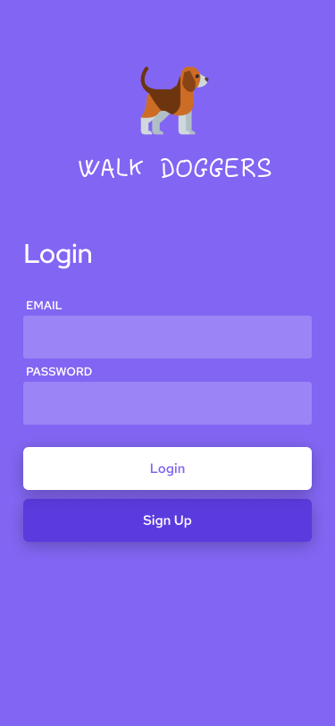
  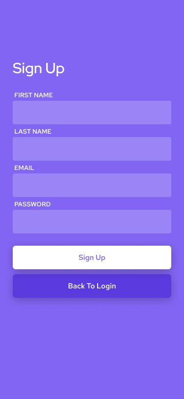

### Prijava na oglas
* **Akterji:** prijavljen uporabnik

  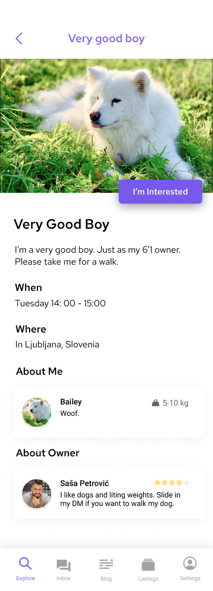
  
  

### Potrditev sprehajalca
* **Akterji:** prijavljen uporabnik (lastnik)

  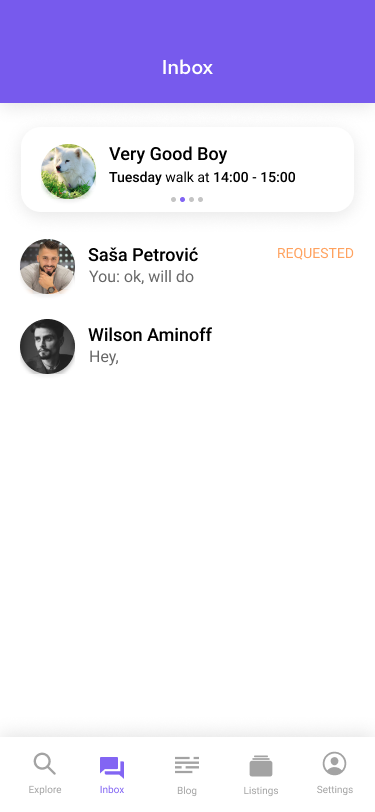
  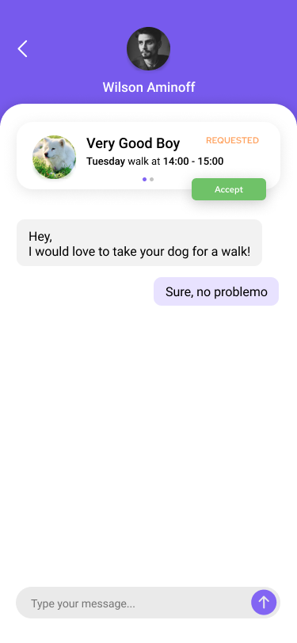
  

### Kontaktiranje sprehajalca za dodatne informacije
* **Akterji:** prijavljen uporabnik (lastnik)

  
  

### Kontaktiranje lastnika za dodatne informacije
* **Akterji:** prijavljen uporabnik 

  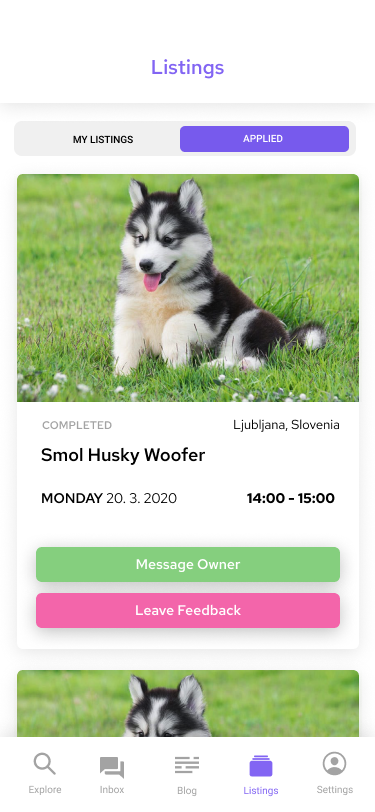

### Pregled podrobnosti prijavljenih oglasov
* **Akterji:** prijavljen uporabnik

  

### Podajanje ocene
* **Akterji:** prijavljen uporabnik

  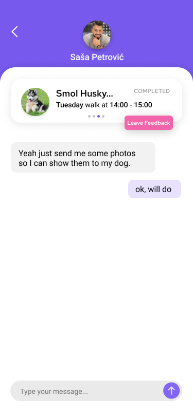
  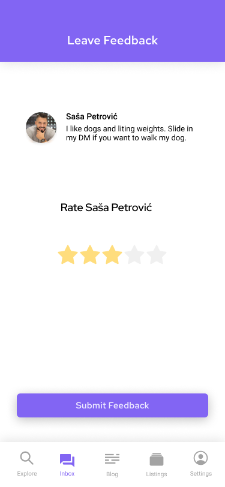

### Objava oglasa
* **Akterji:** prijavljen uporabnik

  
  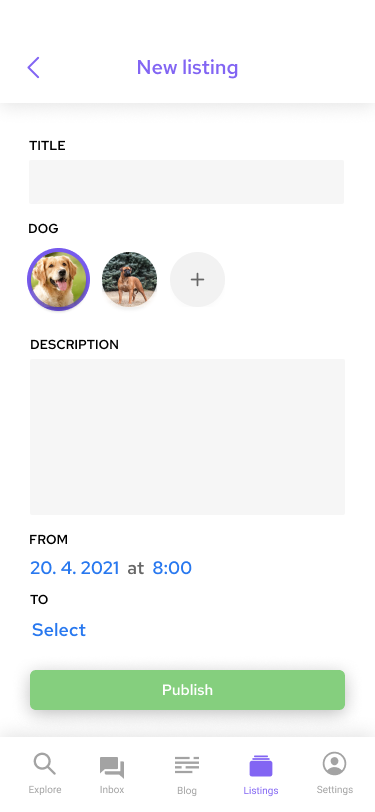

### Dodajanje profila psa
* **Akterji:** prijavljen uporabnik

  
  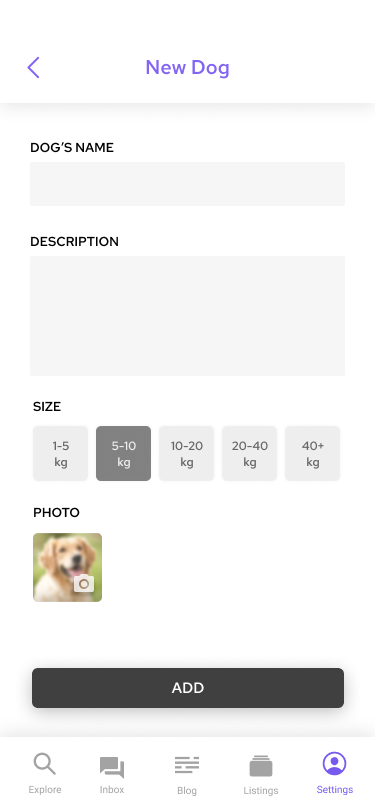

### Urejanje profila psa
* **Akterji:** prijavljen uporabnik

  
  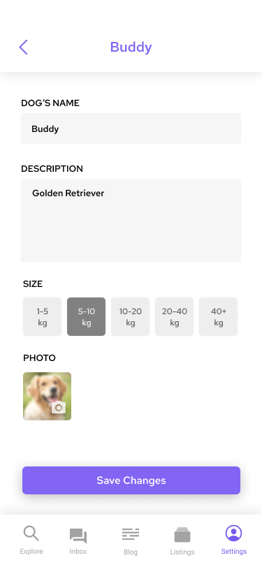

### Pregledovanje filtriranih oglasov
* **Akterji:** neprijavljen uporabnik, prijavljen uporabnik

  

### Urejanje profila
* **Akterji:** prijavljen uporabnik

  
  

### Postani pisec bloga
* **Akterji:** prijavljen uporabnik

  
  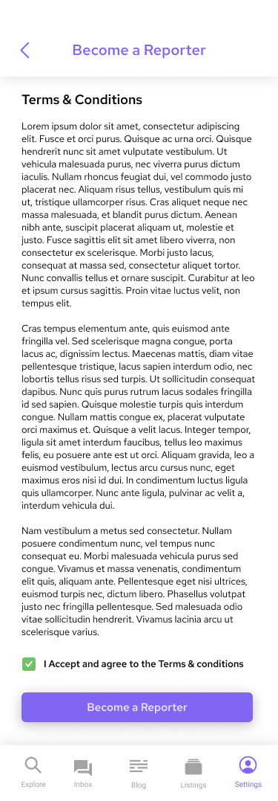

### Pisanje objav na blogu
* **Akterji:** pisec bloga

  
  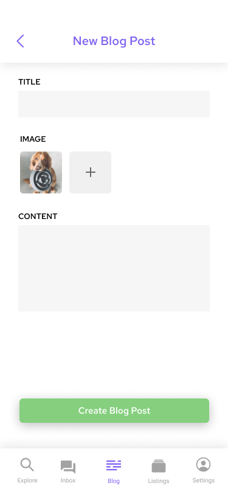

### Potrjevanje objav
* **Akterji:** moderator

  
  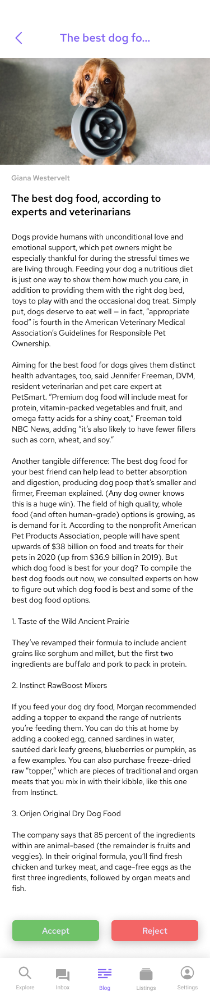

### Brisanje oglasov
* **Akterji:** administrator

  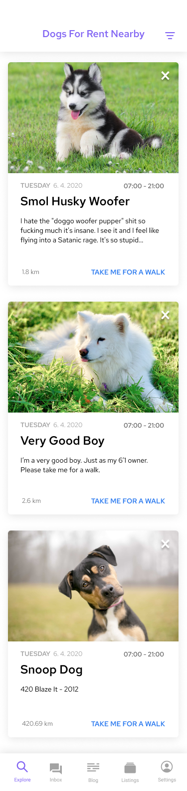

### Brisanje blog objav
* **Akterji:** administrator

  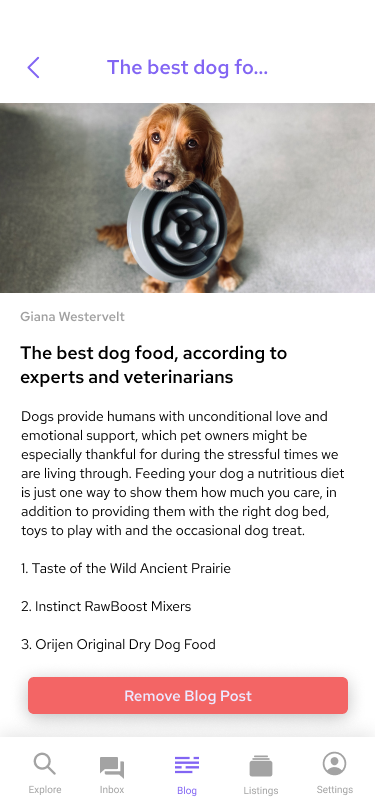

___

## 8. Prototipi vmesnikov

### Geocoding API

Z uporabo API-ja bomo uporabniku aplikacije poenostavili objavo oglasa. Uporabniku ne bo treba vnesti točne lokacije objave oglasa, temveč bomo pridobili koordinate od uporabnika z uporabo gps in jih pretvorili s pomočjo API-ja v polja mesto, okrožje in država. Uporabnik se mora strinjati z uporabo lokacije. Odločili smo se, da se v objavi oglasa prikaže samo mesto in ne tudi točna uporabnikova lokacija, saj ne želimo, da lahko kdorkoli vidi točen naslov našega uporabnika. 

Ko bo prijavljen uporabnik izbral funkcionalnost objave oglasa, ga bo aplikacija najprej vprašala za dovoljenje za dostop do lokacije. Ko uporabnik oglas objavi z Geolocation API iz koordinat pridobimo okviren naslov, ki ne bo razkril točne lokacije lastnika npr. Ljubljana, Slovenija. Podatke o naslovu dobimo v JSON formatu v poljih ‘country’ in  ‘city’. Pridobljeni naslov in koordinate shranimo v podatkovno bazo in na objavljenem oglasu prikažemo naslov.
Primer poizvedbe: https://geocode.xyz/46.020052,14.382740?json=1. 

### DogWalkers API

Zunanji sistemi bodo lahko dostopali do vseh objavljenih oglasov na naši aplikaciji in jih integrirali v svoj sistem. Omogočili bomo dostop do oglasov na DogWalkers na končnih naslovih:

**GET /oglasi/** - vrnemo JSON objekt z vsemi oglasi 

**GET /oglasi/:id** - vrnemo JSON objekt s podrobnostmi izbranega oglasa

**GET /oglasi?geolocation=[city]** - vrnemo JSON objekt z oglasi na določeni lokaciji

Naš API bi lahko uporabljal kdorkoli, ki bi želel prikazovati naše oglase, torej ne potrebuje privatnega ključa.

