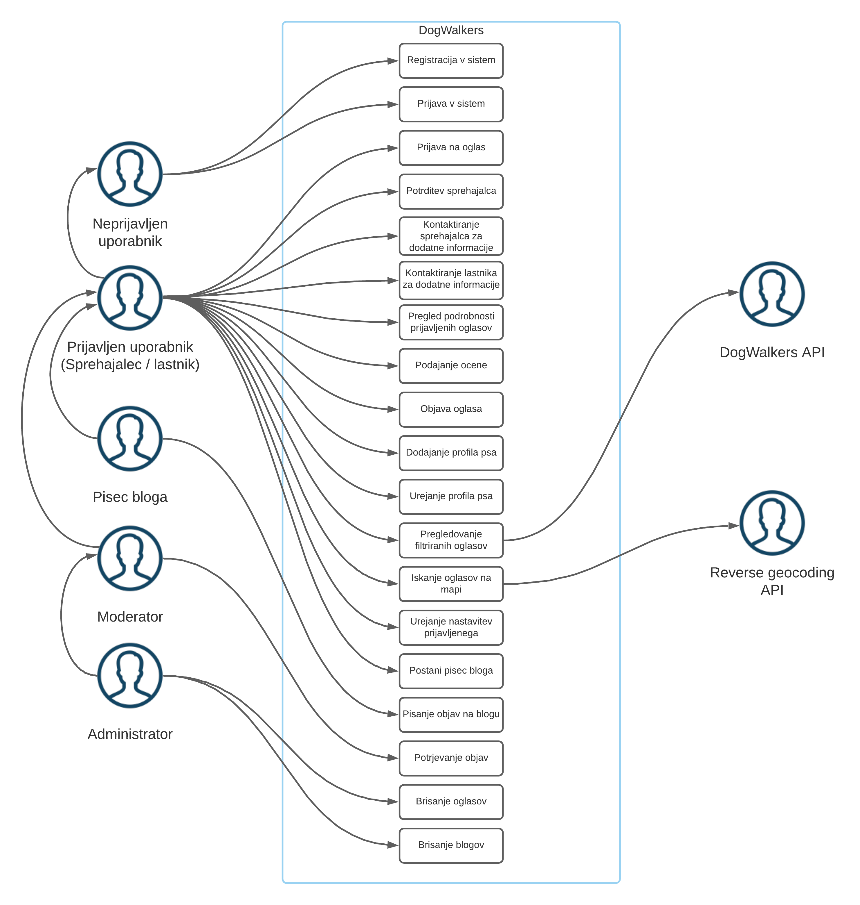
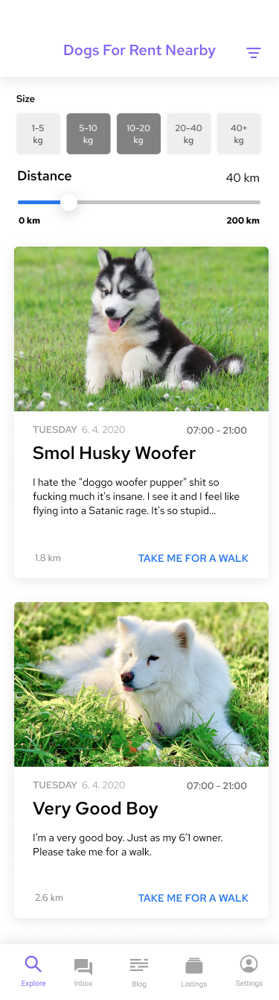
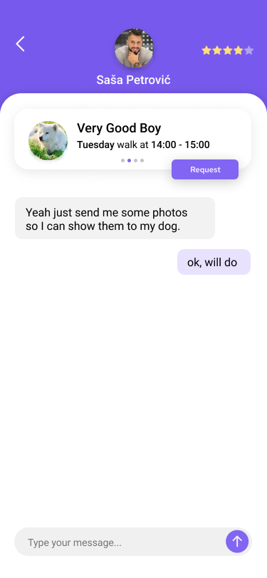
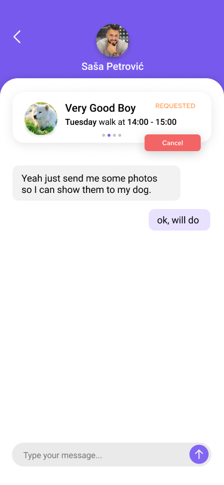
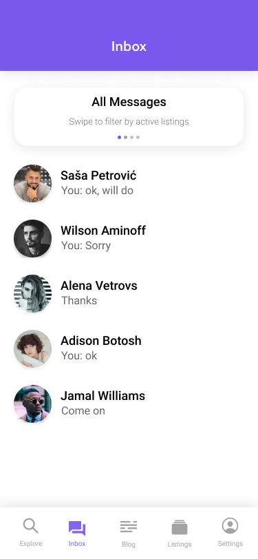
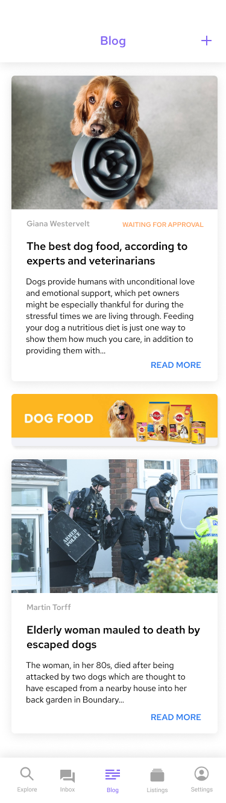

# Dokument zahtev

|                             |                                                         |
| :-------------------------- | :------------------------------------------------------ |
| **Naziv projekta**          | Dog Walkers |
| **Člani projektne skupine** | Matic Bregar, Domen Vilar, Timotej Petrič, Mustafa Grabus in Domen Bukovac |
| **Kraj in datum** | Ljubljana, 05.04.2021 |                              |

## Povzetek projekta
Zaradi hitrega tempa življenja današnje družbe, ljudje velikokrat zapostavljamo domače živali, za katere smo si na začetku, ko so prišle v naš dom vzeli veliko časa. 
Zaradi te težave bomo razvili aplikacijo, ki bo lastnikom psov, ki nimajo veliko prostega časa omogočila, da na enostaven način najdejo sprehajalca, ki svojega ljubljenčka še nima, ali pa se trenutno ne počuti dovolj sposobnega za vsakodnevno skrblenje za domačo žival.

Lastniki psov bodo lahko objavili oglase za sprehajanje psa, na katere se bodo lahko prijavili vsi zainteresirani. Med vsemi kandidati bodo lastniki izbrali najbolj primernega sprehajalca na podlagi profila te osebe ter pogovora preko sporočil. S tem želimo omogočiti, da bodo pasji ljubljenčki imeli primerno družbo. Hkrati bomo tudi zavetiščem ponuditi rešitev, da bodo njihovi psi preživeli več časa zunaj in hitreje našli nov dom. Sprehajalci, ki se trenutno še odločajo za psa, pa bodo lahko izkusili, kako je skrbeti za njih in imeti eno odgovornost več.

## 1. Uvod

Današnja družba je vsak trenutek dneva z nečim zaposlena in okupirana z vseh strani z mediji, oglasi, spletnimi omrežji, predvsem pa večino časa preživi v službi.
Čas je ena izmed najbolj pomembnih vrednot. Velikokrat ga zmanjka za kakšno opravilo ali aktivnost, pa čeprav je ta nujna. Ko lastniki psov spoznajo, da svojemu ljubljenčku ne morejo nuditi vsega, kar potrebuje, velikokrat le ta konča v zavetišču.

Naša aplikacija bo reševala problem zasedenih lastnikov psov, ki jim zaradi vseh obveznosti včasih zmanjka časa, da bi za njih skrbeli spodobno. Z aplikacijo želimo doseči, da se bodo zasedeni lastniki psov odločili za našo rešitev, namesto da dajo psa v zavetišče. S tem bomo razbremenili zasedenost pasjih zavetišč in poskrbeli, da bo čim več kosmatincev imelo topel dom, kjer se bodo počutili ljubljene in zaželene.

Aplikacija Dog Walkers bo omogočala uporabnikom, da bodo za svoje ljubljenčke ustvarili pasje profile, za katere bodo lahko ustvarili oglas za sprehod ali drugačno oskrbo, ko lastnik za to nima časa. Profil psa bi vseboval vse potrebne informacije o psu, torej kako mu je ime, kratek opis, težo ter slika psa. Prijavljena oseba ima svoj profil, na katerih bo vidna povprečna ocena osebe za lažje odločanje ali je potencialen sprehajalec oz. lastnik primeren. 

Oglas, ki ga bo objavil lastnik, bo vseboval informacije o psu, lokacijo, datum in uro termina. Vseboval bo tudi kratek opis oglasa, kjer bo lastnik lahko napisal pomembne informacije ali opombe. Oglase bo lahko videl prijavljeni ali neprijavljeni uporabnik, torej bodo javno dostopni vsem. Samo prijavljeni uporabniki se bodo lahko prijavljali na oglase. Oglasi bodo sortirani glede na oddaljenost lastnika. Pred dejanskim srečanjem in oddajo psa se bo sprehajalec v primeru dodatnih vprašanj najprej prijavil na oglas in nato tudi kontaktiral lastnika prek integriranega sporočilnega sistema.
Lokacija oglasa oz. sprehoda se bo samodejno pridobila pri procesu kreiranja oglasa. Naslov začetka sprehoda bo pridobljen iz pridobljenih koordinat prek zunanjega sistema Reverse Geocoding za pridobivanje naslovov iz koordinat.

Lastnik se bo izmed prijavljenih kandidatov po lastni presoji odločil za enega od sprehajalcev. Pomagal si bo lahko z oceno in pa tudi izmenjanimi sporočili. Izbranemu sprehajalcu bo sprehod odobril, vsi ostali potencialni kandidati, pa bodo na oglasu videli, da je njihova prošnja za sprehajanje zavrnjena.

Aplikacija bo prijavljenim ali neprijavljenim uporabnikom obogočala prebiranje objav na blogu. Na blog bodo lahko uporabniki z vlogo pisca objav objavljali nove zanimive objave. Objave bodo tematsko povezane predvsem s psi, njihovo nego in zanimivimi nasveti. Vsak prijavljen uporabnik bo lahko postal pisec bloga, in sicer s povišanjem samega sebe v Reporterja v razdelku Settings.

Ker v hitrem življenjskem slogu pogosto prihaja do nenadnih sprememb, in ne moremo vsega predvideti vnaprej, aplikacija omogoča tudi urejanje. Urejati bo mogoče profile psov in uporabnikov.

Omenili in deloma opisali smo že, da je **prijavljeni uporabnik** lahko v vlogi lastnika psa, ki bo za svojega psa iskal sprehajalce. Slednji bodo zaradi ljubezni do živali ali želje po oddihu v naravi iskali pse, da bi z njimi preživeli svoj prosti čas na svežem zraku. Svoje vtise in znanje o živalih bodo lahko delili tudi **pisci bloga** tako, da bodo svojo zgodbo objavili na naši platformi. Za vzdrževanje kakovostnih vsebin bodo skrbeli **moderatorji**, ki bodo potrjevali nove blog objave in **administratorji**, ki bodo brisali neprimerne oglase.

Aplikacija ima tudi kar nekaj nefunkcionalnih zahtev. Pri sami aplikaciji bomo poskrbeli, da bo aplikacija dostopna 24 ur na dan z izjemo izpadov na katere bomo pripravljeni in jih čim hitreje odpravili. Mora delovati nemoteno, kljub temu da jo bo sočasno uporabljalo par 100 uporabnikov, ki na posamezno zahtevo ne smejo čakati več kot 3 sekunde. Za uporabniško izkušnjo bomo poskrbeli tako, da bo uporabnik lahko prišel na kateri koli pogled v aplikaciji v manj kot petih klikih.

Zaupni podatki bodo na voljo samo razvijalski ekipi, ki bo za tekoče nemoteno delo uporabljala sistem Git in Kanban tablo.

Aplikacija ne sme biti žaljiva ter rasisitična, zato bodo morali naši moderatorji in admini takšne vsebine odstraniti v manj kot dnevu. Dostop do aplikacije bodo imeli vsi ljudje ter psi ne glede na raso ter pasmo. Hranjenje in deljenje podatkov pa bo skladno s slovensko zakonodajo ter evropsko GDPR ureditvijo.

## 2. Uporabniške vloge

**TO-DO**

- Opredelite glavne tipe uporabnikov vaše aplikacije glede na funkcionalnosti, ki jih imajo na voljo.
- Zelo pomembno je, da uporabniške vloge konsistentno imenujete. Na primer, če ste definirali vlogo **učitelj**, morate povsod uporabljati samostalnik **učitelj**, ne pa morda **profesor** ali **pedagog**. Tehniška besedila žal ne morejo dosegati leposlovnih standardov, tudi če so še tako dobro napisana.

## 3. Slovar pojmov

| **Pojem** | **Opredelitev** |
| - | - | 
|email | e-poštni naslov
|sprehajalec | prijavljeni uporabnik, ki se je prijavil na oglas
|lastnik oglasa | prijavljeni uporabnik, ki je objavil oglas
|potrjeni oglas | lastnik oglasa je prijavljenega sprehajalca potrdil za oglas
|Reporter | imenovanje vloge pisca bloga, v katero se lahko poviša vsak prijavljen uporabnik v nastavitvah
|status Pending| status oglasa, ki pove, da lastnik oglasa še ni potrdil nobenega sprehajalca oz. sprehajalcu lastnik še ni potrdil prijave na oglas
|status Completed | status oglasa, ki pove, da je imel oglas potrjenega sprehajalca in je časovno potekel
|status Arranged | status oglasa, ki pove, da ima oglas potrjenega sprehajalca
|status Requested | status oglasa, ki pove, da se sprehajalec zanima za oglas
|status Listed | status oglasa
|status Finished | status oglasa, ki pove, da je oglas končan (status Completed) in sprehajalec oz. lastnik je ocenjen
|sporočilno okno | pogled v katerem dva prijavljena uporabnika lahko komunicirata med sabo
|lastnik | prijavljen uporabnik, ki ima objavljen vsaj en oglas
|sprehajalec | prijavljen uporabnik, ki se je prijavil na vsaj en oglas za sprehajanje psa
|razdelek | Glavni meniji aplikacije. Vseh razdelkov je pet (od leve proti desni): Explore, Inbox, Blog, Listings, Settings. |Smiselno ločujejo aplikacijo.
|razdelek Explore | prikazuje seznam oglasov
|razdelek Inbox | prikazuje sporočila z ostalimi uporabniki
|razdelek Blog | prikazuje seznam objav
|razdelek Listings | prikazuje seznam oglasov na katere smo se prijavili in seznam oglasov, ki smo jih objavili
|razdelek Settings | razdelek, kjer lahko prijavljen uporabnik ureja nastavitve svojega profila
|Filtrirno okno oglasov | prvo mesto v filtrirnem oknu zasede All Messages, nasledna pa so v časovnem zaporedju razporejeni oglasi od najnovejših do najstarejših med katerimi se premikamo z drsnim potegom

## 4. Diagram primerov uporabe

## 5. Funkcionalne zahteve

### Registracija

Neprijavljen uporabnik se lahko registrira na strani. Ob registraciji vpiše ime, priimek, email in geslo.

#### Osnovni tok

1. Neprijavljen uporabnik izbere funkcionalnost registracija.
2. Aplikacija mu ponudi registracijski obrazec.
3. Neprijavljen uporabnik izpolni registracijski obrazec. Vpiše svoje ime, priimek, email in geslo. Geslo je dolgo vsaj 8 znakov in sestavljeno iz velikih in malih črk, številk ter vsaj enega posebnega znaka.
4. Neprijavljen uporabnik odda registracijski obrazec.
5. Aplikacija prikaže obvestilo o uspešni registraciji.

#### Alternativni tok

**Alternativni tok 1**

1. Neprijavljen uporabnik želi dostopati do funkcionalnosti, ki je na voljo le prijavljenim uporabnikom.
2. Aplikacija neprijavljenemu uporabniku prikaže obvestilo, da je zahtevana funkcionalnost na voljo le prijavljenim uporabnikom. Aplikacija ponudi možnost preusmeritve na registracijsko stran.
3. Neprijavljen uporabnik izbere možnost za preusmeritev na stran za registracijo (funkcionalnost registracija).
4. Aplikacija mu ponudi registracijski obrazec.
5. Neprijavljen uporabnik izpolni registracijski obrazec. Vpiše svoje ime, priimek, email in geslo. Geslo je dolgo vsaj 8 znakov in sestavljeno iz velikih in malih črk, številk ter vsaj enega posebnega znaka.
6. Neprijavljen uporabnik odda registracijski obrazec.
7. Aplikacija prikaže obvestilo o uspešni registraciji.

#### Izjemni tok

**Izjemni  tok 1**
* Neprijavljen uporabnik je za registracijo uporabil email naslov, ki je že vezan na nek uspešno registriran račun. Aplikacija vrne obvestilo o že uporabljenem email naslovu in ga pozove k uporabi drugega.

**Izjemni  tok 2**
* Neprijavljen uporabnik vnese geslo, ki ni sestavljeno iz velikih in malih črk, številk ter vsaj enega posebnega znaka in ni dolgo vsaj 8 znakov. Obrazec odda. Aplikacija prikaže obvestilo o neprimernem geslu.

#### Pogoji
* Neprijavljen uporabnik aplikacije za uspešno izvedeno registracijo še ne sme biti prijavljen ali registriran v sistem z email naslovom, ki ga je vpisal v registracijski obrazec.

#### Posledice
* Če neprijavljen uporabnik dobi obvestilo o uspešni registraciji, je uspešno registriran. Sedaj se lahko prijavi v aplikacijo s svojim email naslovom in geslom, ki ga je vnesel ob registraciji v registracijski obrazec. Po uspešni prijavi dobi dostop do več funkcionalnosti aplikacije.

#### Posebnosti

Registracijski podatki se med aplikacijo in strežnikom prenašajo po varni povezavi. V bazi so shranjeni z upoštevanje priporočil dobre in varne prakse hranjenja občutljivih podatkov.

#### Prioritete identificiranih funkcionalnosti

MUST HAVE

#### Sprejemni testi

* **[Osnovni tok]** Neprijavljen uporabnik izpolne registracijski obrazec. Sedaj se lahko prijavi v sistem.
* **[Alternativni tok 1]** Neprijavljen uporabnik želi dostopati do funkcionalnosti, ki je na voljo le prijavljenim uporabnikom. Aplikacija mu ponudi možnost preusmeritve na registracijsko stran.
* **[Izjemni tok 1]** Neprijavljeni uporabnik je za registracijo uporabi email naslov, ki je že vezan na nek uspešno registriran račun. Aplikacija mu prepreči registracijo s tem email naslovom in mu prikaže obvestilo o že uporabljenem email naslovu ter ga pozove k uporabi drugega.
* **[Izjemni tok 2]** Neprijavljen uporabnik vnese geslo, ki ni pravilne oblike. Po oddaji obrazca dobi obvestilo o neprimernem geslu.
___
### Prijava

Neprijavljen uporabnik se lahko prijavi v sistem. Ko je prijavljen, lahko dostopa do več funkcionalnosti.

#### Osnovni tok

1. Neprijavljen uporabnik izbere funkcionalnost prijava.
2. Aplikacija mu ponudi prijavni obrazec.
3. Neprijavljen uporabnik izpolni prijavni obrazec. Vpiše svoj email in geslo.
4. Neprijavljen uporabnik odda prijavni obrazec.
5. Aplikacija prikaže obvestilo o uspešni prijavi.

#### Alternativni tok

1. Neprijavljen uporabnik želi dostopati do funkcionalnosti, ki je na voljo le prijavljenim uporabnikom.
2. Aplikacija prijavljenemu uporabniku prikaže obvestilo, da je zahtevana funkcionalnost na voljo le prijavljenim uporabnikom. Aplikacija ponudi možnost preusmeritve na prijavno stran.
3. Neprijavljen uporabnik izbere možnost za preusmeritev na stran za prijavo (funkcionalnost prijava).
4. Aplikacija mu ponudi prijavni obrazec.
5. Neprijavljen uporabnik izpolni prijavni obrazec. Vpiše svoj email in geslo.
6. Neprijavljen uporabnik odda prijavni obrazec.
7. Aplikacija prikaže obvestilo o uspešni prijavi.

#### Izjemni tok

**Izjemni  tok 1**
* Neprijavljen uporabnik je za prijavo uporabil napačen email naslov ali geslo. Aplikacija zavrne prijavo in prikaže obvestilo o neuspešni prijavi.

#### Pogoji
* Da se uporabnik lahko prijavi se mora pred tem uspešno registrirati. 

#### Posledice
* Uporabnik je uspešno prijavljen v sistem. Vloga neprijavljenega uporabnika se spremeni.
* Lahko dobi vlogo prijavljenega uporabnika, pisca bloga, moderatorja ali administratorja, če ima dodane pravice.

#### Posebnosti

Podatki o prijavi se pošiljajo po varni povezavi.

#### Prioriteta

MUST HAVE

#### Sprejemni testi

* **[Osnovni tok]** Neprijavljen uporabnik vnese svoj email naslov in geslo. V primeru pravilnega email naslova in gesla se uporabnik uspešno prijavi.
* **[Alternativni tok 1]** Neprijavljen uporabnik želi dostopati do funkcionalnosti, ki je na voljo le prijavljenim uporabnikom. Aplikacija mu ponudi možnost preusmeritve na prijavno stran.
* **[Izjemni tok 1]** Prijavimo se z napačnim email naslovom ali geslom. Aplikacija zavrne prijavo.

___

### Prijava na oglas

Registriran uporabnik se lahko prijavi na oglas za sprehajanje psa.

#### Osnovni tok

1. Prijavljen uporabnik v aplikaciji izbere razdelek Explore.
2. Prijavljen uporabnik poišče oglas za psa in izbere Take me for a walk.
3. Aplikacija prijavljenemu uporabniku prikaže podrobnosti oglasa. Prikaže se slika in opis psa, časovni okvir in lokacija sprehajanja psa ter opis lastnika.
4. Če prijavljenemu uporabniku oglas ustreza, klikne gumb I’m Interested.
5. Odpre se nov sporočilni pogovor, kjer lahko sprehajalec vpraša po dodatnih informacijah lastnika.
6. Prijavljeni uporabnik lahko klikne gumb Request in pošlje prošnjo za sprehajanje psa za izbrani oglas.

#### Alternativni tok

Aplikacija ne podpira alternativnih tokov za to funkcionalnost.

#### Izjemni tok

**Izjemni  tok 1**
* Vsak uporabnik, ki hoče iskati po oglasih psov, lahko naleti, da v njegovi okolici ni nobenih psov za sprehajanje. Sistem mu prikaže obvestilo, da trenutno ni na voljo nobenih psov za sprehajanje ter, da naj poskusi kasneje.

#### Pogoji
* Uporabnik mora imeti vlogo prijavljenega uporabnika. Neprijavljenega uporabnika sistem preusmeri na stran za registracijo/prijavo, zato mu ta funkcionalnost ni na voljo.

#### Posledice
* Ko se prijavljen uporabnik prijavi na oglas, lastnik oglasa vidi, da se je sprehajalec prijavil na njegov oglas. 
* Prijavljeni uporabnik oglas vidi v razdelku Listings v zavihku Applied, kjer vidi tudi vse ostale prijave na oglase. 
* Prijavljeni oglas dobi status Pending. 
* Prijava na oglas se pojavi v Inboxu v filtrirnem oknu oglasov.

#### Posebnosti

Posebnosti ni.

#### Prioriteta

MUST HAVE

#### Sprejemni testi

* **[Osnovni tok]** Prijavljen uporabnik med oglasi izbere enega izmed oglasov ter se nanj prijavi. Oglas je sedaj viden v razdelku Listings v zavihku Applied.

* **[Izjemni tok 1]** Prijavljen uporabnik v razdelku Explore nastavi filter največje oddaljenosti oglasa na vrednost, ki ne vrne nobenega rezultata. Prikaže se obvestilo, da trenutno ni na voljo nobenih psov za sprehajanje.

___

### Potrditev sprehajalca

Prijavljen uporabnik lahko potrdi sprehajalca za svoj oglas.

#### Osnovni tok

1. Prijavljen uporabnik klikne na razdelek Listings na zavihek My listings.
2. Aplikacija prijavljenemu uporabniku prikaže vse njegove objavljene oglase in njihov status. 
3. Prijavljen uporabnik poišče oglas s statusom Listed. Taki oglasi še nimajo potrjenega sprehajalca.
4. Prijavljeni uporabnik klikne na gumb Applied users.
5. Prijavljenemu uporabniku je preusmerjen na prej izbrani oglas v razdelku Inbox. Vidni so vsi sprehajalci, ki so se prijavili na njegov oglas.
6. Prijavljen uporabnik lahko klikne na enega izmed sprehajalcev.
7. Aplikacija prikaže sporočilni pogovor s prijavljenim sprehajalcem.
8. Prijavljen uporabnik lahko potrdi prošnjo za oglas s klikom na gumb Accept.

#### Alternativni tok

1. Prijavljen uporabnik, ki oddaja svojega psa za sprehod, klikne na razdelek Inbox.
2. V filtrirnem oknu oglasov poišče želeni oglas.
3. Izbere želenega sprehajalca, ki se je za njegov oglas zanimal. Prijavljen uporabnik je preusmerjen v sporočilno okno s to osebo.
4. V filtrirnem oknu oglasov lahko prijavljen uporabnik potrdi sprehajalca za objavljeni oglas.

#### Izjemni tok

Aplikacija ne podpira izjemnih tokov za to funkcionalnost.

#### Pogoji
* Prijavljen uporabnik lahko potrdi sprehajalca, samo če je objavil oglas.
* Vsaj en sprehajalec se mora prijaviti na oglas, da ga prijavljeni uporabnik lahko potrdi. 
* Oglas, ki ga želi lastnik potrditi, mora imeti status Pending.

#### Posledice
* Potrjeni oglas ni več viden v razdelku Explore.

**Za prijavljenega uporabnika (vloga lastnika)**
* Status objavljenega oglasa v razdelku Listings v zavihku My Listings spremeni iz Listed v Arranged.
* Status sprehajalca, ki ga je prijavljen uporabnik potrdil, se v razdelku Inbox izbranega oglasa, spremeni v Arranged. 
* Status ostalih sprehajalcev, ki jih uporabnik ni potrdil, se spremeni v Denied. 

**Za potrjenega sprehajalca (vloga sprehajalca)**
* V razdelku Inbox v filtrirnem oknu potrjenega oglasa se status spremeni v Accepted.
* Status prijavljenega oglasa v razdelku Listings pod zavihkom Applied se spremeni iz Pending v Accepted.

#### Posebnosti

Posebnosti ni.

#### Prioriteta

MUST HAVE

#### Sprejemni testi

* **[Osnovni tok]** Prijavljen uporabnik se premakne na razdelek Listings pod zavihek My listings in poišče oglas, ki ga želiš potrditi. Izbere želenega sprehajalca in ga potrdi.
* **[Alternativni tok 1]** Prijavljeni uporabnik se premakne na razdelek Inbox, v filtrirnem oknu najde svoj oglas, izbere želenega sprehajalca in ga potrdi.

___

### Kontaktiranje sprehajalca za dodatne informacije

Prijavljeni uporabnik lahko kontaktira sprehajalca za dodatne informacije glede oglasa.

#### Osnovni tok

1. Prijavljeni uporabnik klikne na razdelek Listings, na zavihek My listings.
2. Aplikacija prikaže vse oglase, ki jih je uporabnik objavil.
3. Prijavljeni uporabnik se premakne na razdelek Listings na zavihek My listings.
4. Prijavljeni uporabnik poišče oglas in klikne na gumb Applied users.
5. Odpre se Inbox. V filtirinem oknu oglasov je izbran ciljni oglas iz točke 4. Spodaj so torej vidne vse prijavljene osebe na ta oglas. 
6. Uporabnik klikne na sprehajalca, ki ga želi kontaktirati.
7. Prijavljeni uporabnik lahko komunicira s sprehajalcem preko sporočil.

#### Alternativni tok

**Alternativni tok 1**
1. Prijavljeni uporabnik odpre zavihek Inbox. V filtrirnem oknu oglasov izbere All messages.
2. Klikne na pogovor z izbranim sprehajalcem.
3. Prijavljeni uporabnik lahko komunicira s sprehajalcem preko sporočil.

**Alternativni tok 2**
1. Prijavljeni uporabnik odpre zavihek Inbox. V filtrirnem oknu oglasov izbere oglas, na katerega se je prijavil sprehajalec, ki ga lastnik želi kontaktirati.
2. Prikažejo se samo sprehajalci, ki so se prijavili na ciljni oglas.
3. Klikne na pogovor z izbranim sprehajalcem.
4. Prijavljeni uporabnik lahko komunicira s sprehajalcem preko sporočil.

#### Izjemni tok
Aplikacija ne podpira izjemnih tokov za to funkcionalnost.

#### Pogoji
* Sprehajalec, ki ga prijavljeni uporabnik želi kontaktirati, se je prijavil na enega od oglasov.
* **[Alternativni tok 1]** Prijavljeni uporabnik in sprehajalec sta si izmenjala vsaj eno sporočilo.

#### Posledice
* Prijavljeni uporabnik naveže stik s sprehajalcem oz. ga kontaktira. 
* V razdelku Inbox v filtrirnem oknu oglasov, pod izborom All messages, se na vrhu prikaže pogovor s sprehajalcem.

#### Posebnosti
Posebnosti ni.

#### Prioriteta
SHOULD HAVE

#### Sprejemni testi

* **[Osnovni tok]** Prijavljeni uporabnik poišče svoj objavljen oglas v razdelku Listings pod zavihkom My listings. Klikne na gumb Applied Users. Odpre se razdelek Inbox in v filtrirnem oknu oglasov se pokaže izbrani oglas. Spodaj je prikazan seznam prijavljenih ljudi na oglas. Uporabnik izbere ciljno osebo. Odpre se sporočilni pogovor z osebo. Uporabnik napiše sporočilo in ga pošlje. Sporočilo je vidno v sporočilnem oknu.

* **[Alternativni tok 1]** Prijavljeni uporabnik odpre razdelek Inbox. V filtrirnem oknu oglasov izbere All messages. Klikne na ciljno osebo. Napiše sporočilo in ga pošlje. Sporočilo je vidno v sporočilnem oknu.

* **[Alternativni tok 2]** Prijavljeni uporabnik odpre razdelek Inbox. V filtrirnem oknu oglasov izbere oglas, na katerega se je ciljna oseba prijavila. Klikne na ciljno osebo. Napiše sporočilo in ga pošlje. Sporočilo je vidno v sporočilnem oknu.

___

### Kontaktiranje lastnika za dodatne informacije

Prijavljeni uporabnik lahko kontaktira lastnika za dodatne informacije.

#### Osnovni tok

1. Prijavljeni uporabnik klikne na razdelek Listings na zavihek Applied.
2. Aplikacija prikaže vse oglase, na katere se je uporabnik prijavil.
3. Prijavljeni uporabnik poišče oglas, katerega lastnika želi kontaktirati.
4. Prijavljeni uporabnik lahko klikne na gumb Message Owner.
5. Aplikacija odpre pogovor, kjer se lahko prijavljeni uporabnik pogovarja z lastnikom.

#### Alternativni tok

**Alternativni tok 1**
1. Prijavljeni uporabnik odpre zavihek Inbox. V filtrirnem oknu oglasov izbere All messages.
2. Klikne na pogovor z izbranim lastnikom.
3. Prijavljeni uporabnik lahko komunicira z lastnikom preko sporočil.

**Alternativni tok 2**
1. Prijavljeni uporabnik odpre zavihek Inbox.  V filtrirnem oknu oglasov izbere oglas na katerega se je prijavil.
2. Aplikacija pokaže lastnika oglasa.
3. Prijavljeni uporabnik klikne na lastnika oglas. Odpre se sporočilni pogovor, kjer lahko komunicira z lastnikom preko sporočil.

**Alternativni tok 3**
1. Prijavljeni uporabnik v razdelku Explore poišče oglas, katerega lastnika želi kontaktirati.
2. Prijavljeni uporabnik lahko klikne Take me for a walk in prikažejo se mu podrobnosti oglasa.
3. Prijavljeni uporabnik lahko klikne I’m interested in odpre se mu sporočilni pogovor, kjer lahko kontaktira lastnika.

#### Izjemni tok
Aplikacija ne podpira izjemnih tokov za to funkcionalnost.

#### Pogoji
* **[Osnovni tok]** Prijavljeni uporabnik mora biti prijavljen na oglas.
* **[Alternativni tok 1]**  Prijavljeni uporabnik in lastnik sta si izmenjala vsaj eno sporočilo.
* **[Alternativni tok 2]**  Prijavljeni uporabnik mora biti prijavljen na oglas.

#### Posledice
* Če prijavljen uporabnik kontaktira lastnika psa, to pomeni, da se mu v razdelku Inbox v filtrirnem oknu oglasov pod izbranim filtrom All messages odpre pogovor z lastnikom psa. 
* Prijavljeni uporabnik naveže stik z lastnikom psa.

#### Posebnosti

Komunikacija med sprehajalcem ter lastnikom mora potekati po varni povezavi.

#### Prioriteta

SHOULD HAVE

#### Sprejemni testi

* **[Osnovni tok]** Prijavljeni uporabnik v razdelku Listings pod zavihkom Applied poišče oglas lastnika, ki ga želi kontaktirati. Klikne gumb Message Owner na izbranem oglasu in začne pogovor z lastnikom.

* **[Alternativni tok 1]** Prijavljen uporabnik v razdelku Inbox v filtrirnem oknu oglasov pod All messages klikne lastnika, ki ga želi kontaktirati. Napiše sporočilo in ga pošlje. Sporočilo je vidno v sporočilnem oknu.

* **[Alternativni tok 2]** Prijavljen uporabnik v razdelku Inbox v filtrirnem oknu oglasov izbere oglas, katerega lastnika želi kontaktirati. Napiše sporočilo in ga pošlje. Sporočilo je vidno v sporočilnem oknu.

* **[Alternativni tok 3]** Prijavljeni uporabnik poišče oglas v razdelku Explore od koder lahko kontaktira lastnika oglasa. Napiše sporočilo in ga pošlje. Sporočilo je vidno v sporočilnem oknu.

___

### Pregled podrobnosti prijavljenih oglasov

Prijavljeni uporabnik lahko pogleda podrobnosti oglasa na katerega se je prijavil.

#### Osnovni tok
1. Prijavljeni uporabnik klikne na Listings na zavihek Applied.
2. Aplikacija prikaže vse oglase na katere se je prijavljeni uporabnik prijavil.
3. Prijavljeni uporabnik na seznamu vseh oglasov poišče oglas, ki ga zanima.
4. Prijavljenemu uporabniku se prikažejo podrobnosti oglasa.

#### Alternativni tok
Aplikacija ne podpira alternativnih tokov za to funkcionalnost.

#### Izjemni tok
Aplikacija ne podpira izjemnih tokov za to funkcionalnost.

#### Pogoji
* Uporabnik mora biti prijavljen v sistem, ter prijavljen na vsaj en oglas. Če ni prijavljen v sistem ali na oglas mu ta funkcionalnost ni na voljo.

#### Posledice
* Posledic ni, uporabnik si zgolj še enkrat ogleda oglas.

#### Posebnosti
Posebnosti ni.

#### Prioriteta
SHOULD HAVE

#### Sprejemni testi

* **[Osnovni tok]** Prijavljeni uporabnik v razdelku Listings v zavihku Applied izbere en oglas in si ogleda podrobnosti oglasa.

___

### Podajanje ocene

Prijavljeni uporabnik lahko poda oceno sprehajalcu oz. lastniku.

#### Osnovni tok

1. Prijavljeni uporabnik izbere razdelek Listings in zavihek My Listings za ocenitev sprehajalca oz. Applied za ocenitev lastnika.
2. Prijavljeni uporabnik poišče oglas, ki ima status Completed, kar pomeni da še ni ocenjen.
3. Prijavljeni uporabnik klikne na gumb Leave a review.
4. Prijavljeni uporabnik vnese oceno od ena do pet.
5. Prijavljeni uporabnik potrdi vnos ocene za sprehajalca oz. lastnika.

#### Alternativni tok
Aplikacija ne podpira alternativnih tokov za to funkcionalnost.

#### Izjemni tok
Aplikacija ne podpira izjemnih tokov za to funkcionalnost.

#### Pogoji
* Sprehajalec ima v razdelku Listings v zavihku Applied oglas s statusom Completed.
* Lastnik ima v razdelku Listings v zavihku My Listings oglas s statusom Completed.

#### Posledice
* Osebi, ki jo je prijavljeni uporabnik ocenil, se povprečna ocena spremeni.

#### Posebnosti
Posebnosti ni.

#### Prioriteta
COULD HAVE

#### Sprejemni testi
* **[Osnovni tok]** Prijavljeni uporabnik izbere oglas, ki ga še ni ocenil in sprehajalca oz. lastnika oglasa oceni.
___

## 6. Nefunkcionalne zahteve

**TO-DO**

- Navedite splošne omejitve, ki jih moramo upoštevati v več funkcionalnostih ali celo skozi celoten razvoj aplikacije.

## 7. Osnutki zaslonskih mask

**TO-DO**

## 8. Prototipi vmesnikov

**TO-DO**

- Navesti je potrebno: zaslonske maske, sistemske vmesnike in vmesnike do naprav, vključno z referencami do primerov uporabe.

## 6. Nefunkcionalne zahteve

**TO-DO**

- Navedite splošne omejitve, ki jih moramo upoštevati v več funkcionalnostih ali celo skozi celoten razvoj aplikacije.

## 7. Osnutki zaslonskih mask

**TO-DO**

#### Prijava na oglas

  
  
  

#### Explore

#### Inbox

#### Blog

#### Listings

#### Profile

## 8. Prototipi vmesnikov

**TO-DO**

- Navesti je potrebno: zaslonske maske, sistemske vmesnike in vmesnike do naprav, vključno z referencami do primerov uporabe.
